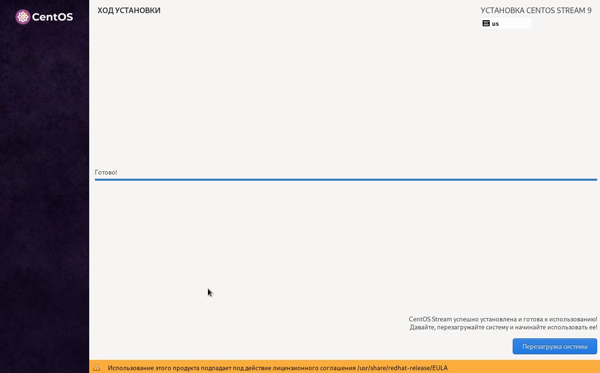

---
## Front matter
lang: ru-RU
title: Установка и конфигурация операционной системы на виртуальную машину
subtitle: Лабораторная работа № 1
author:
  - Абу Сувейлим М. М.
institute:
  - Российский университет дружбы народов, Москва, Россия
date: 10 января 2003

## i18n babel
babel-lang: russian
babel-otherlangs: english

## Formatting pdf
toc: false
toc-title: Содержание
slide_level: 2
aspectratio: 169
section-titles: true
theme: metropolis
header-includes:
 - \metroset{progressbar=frametitle,sectionpage=progressbar,numbering=fraction}
---

# Информация

## Докладчик

:::::::::::::: {.columns align=center}
::: {.column width="70%"}

  * Абу Сувейлим Мухаммед Мунифович
  * студент
  * Российский университет дружбы народов
  * [1032215135@pfur.ru](mailto:1032215135@pfur.ru)
  * <https://mukhammed-abu-suveilim.github.io/>

:::
::::::::::::::

# Вводная часть

## Цели и задачи

- Установить операционную систему Linux на виртуальную машину.
- Настроить минимальные необходимые для дальнейшей работы сервисы.

## Материалы и методы

- Документ по лабараторной работе № 1 "Лабораторная работа № 1. Установка и конфигурация
операционной системы на виртуальную машину"
- Блог Рег.ру. 2023.

# Git

## Репозиторий на домашнем хост машине

- Создал репозиторий через Git на домашнем хост машине и доключил его к аккунту на GitHub (рис. [-@fig:012]).

{#fig:012 width=70%}

# Выполнение лабораторной работы

## Установка операционной системы на виртуальную машину

1. Указал путь в свойствах VirtualBox на месторасположение каталога для виртуальных машин. Также, выбрал тип ОС Linux (Centos от Red Hat (64-bit)) (рис. [-@fig:001]). 

{#fig:001 width=70%}

## Установка операционной системы на виртуальную машину

2. Назначал размер основной памяти виртуальной машины (рис. [-@fig:002]) - 8048 МБ.

## Установка операционной системы на виртуальную машину

{#fig:002 width=70%}

## Установка операционной системы на виртуальную машину

3. Далее, я определил размер виртуального динамического жёсткого диска и его расположения (рис. [-@fig:003]) 40 ГБ.

## Установка операционной системы на виртуальную машину

{#fig:003 width=70%}

## Установка операционной системы на виртуальную машину

4. Вся информация установки ОС (рис. [-@fig:004]).

{#fig:004 width=70%}

## Установка операционной системы на виртуальную машину

5. Подключение образа оптического диска (рис. [-@fig:005])

{#fig:005 width=70%}

## Установка операционной системы на виртуальную машину

6. Запустид виртуальную машину (рис. [-@fig:006]), выберите Russian в качестве языка интерфейса (рис. [-@fig:007]) и перешел к настройкам установки операционной системы (рис. [-@fig:008]).

{#fig:006 width=70%}

## Установка операционной системы на виртуальную машину

{#fig:007 width=70%}

## Установка операционной системы на виртуальную машину

{#fig:008 width=70%}

## Установка операционной системы на виртуальную машину

8. В разделе выбора программ указал в качестве базового окружения Server with GUI , а в качестве дополнения — Development Tools (рис. [-@fig:009]). Отключил KDUMP. Место установки ОС оставил без изменения. Включил сетевое соединение и в качестве имени узла указал
smabu.

{#fig:009 width=70%}

## Установка операционной системы на виртуальную машину

9. Завершение установки ОС (рис. [-@fig:010]).

{#fig:010 width=70%}

## Установка операционной системы на виртуальную машину

10. В итоге, я подключил образ диска дополнений гостевой ОС и запустил его (рис. [-@fig:011]).

## Установка операционной системы на виртуальную машину

{#fig:011 width=70%}

# Вывод

Успешно устновил операционную систему на виртуальную машину, настройл минимально необходимых для дальнейшей работы сервисов.

