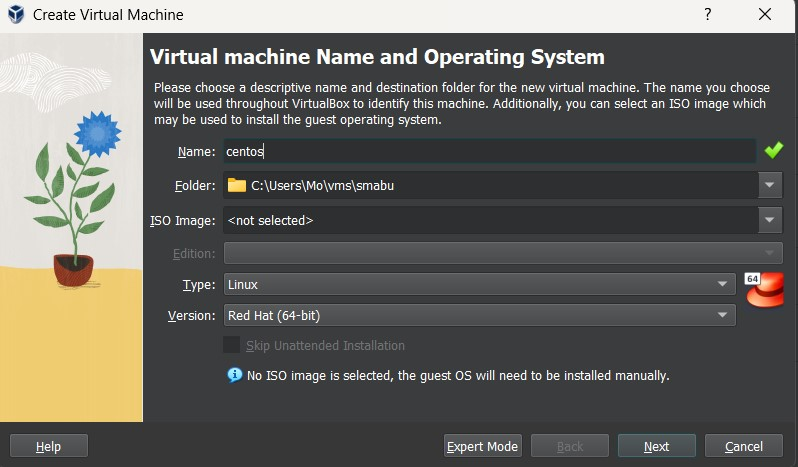
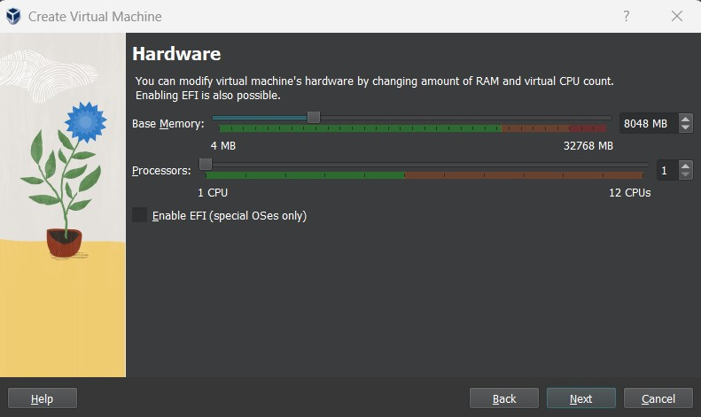
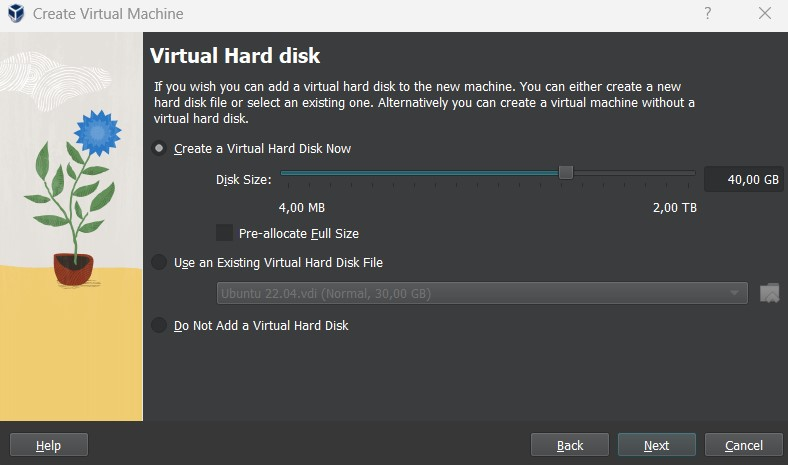
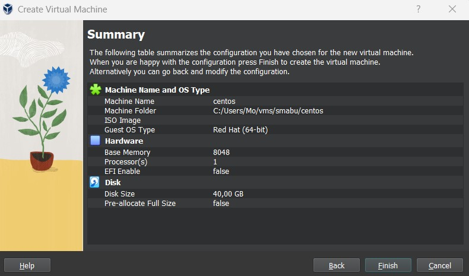
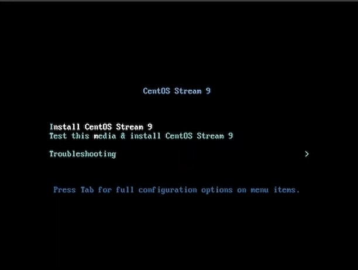
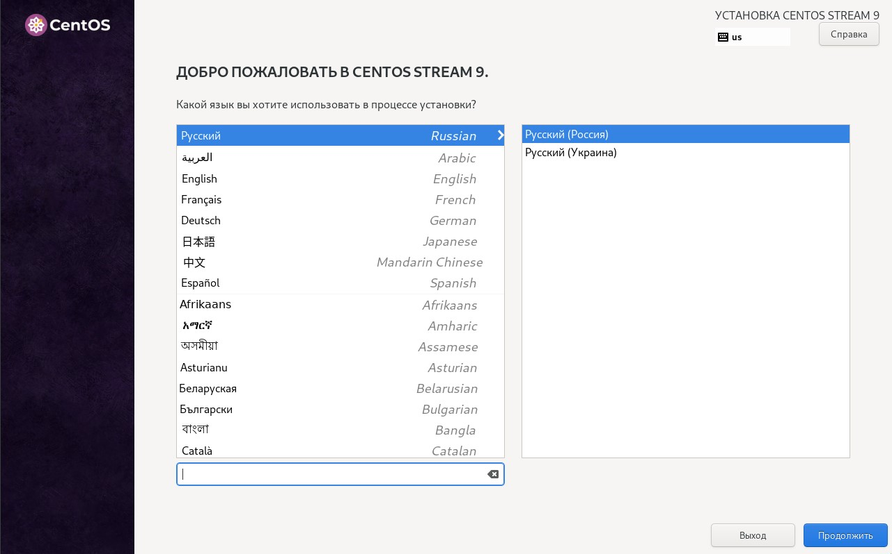
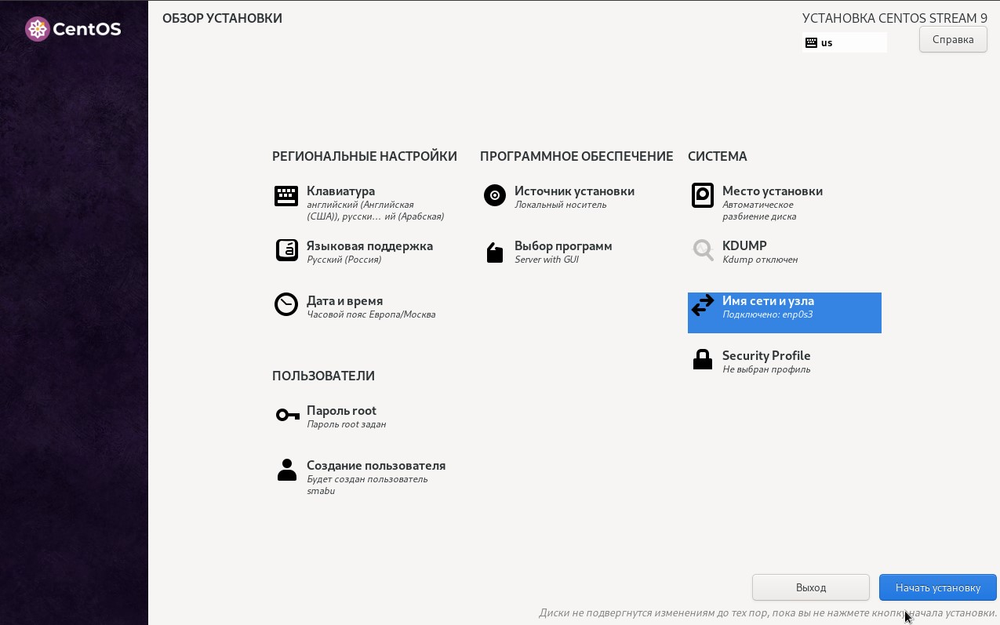
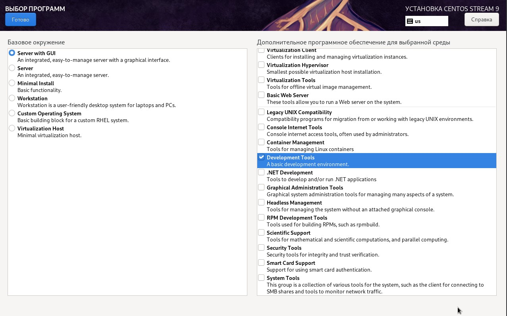
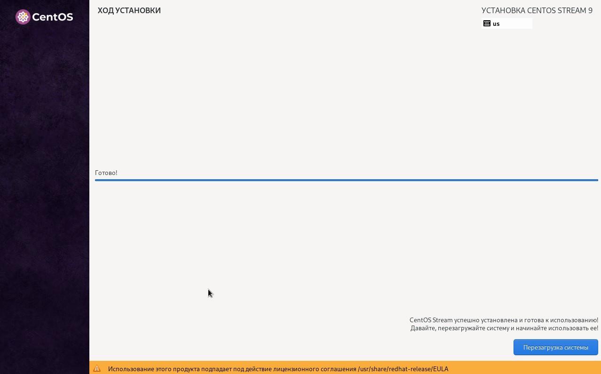
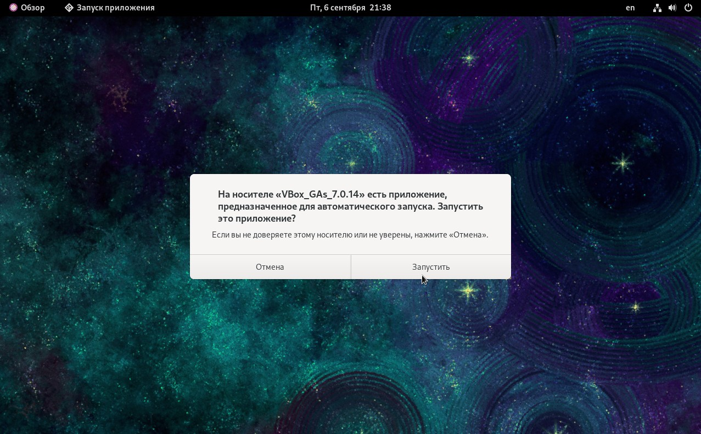

---
## Front matter
title: "Установка и конфигурация операционной системы на виртуальную машину"
subtitle: "Лабораторная работа № 1"
author: "Абу Сувейлим Мухаммед Мунифович"

## Generic otions
lang: ru-RU
toc-title: "Содержание"

## Bibliography
bibliography: bib/cite.bib
csl: pandoc/csl/gost-r-7-0-5-2008-numeric.csl

## Pdf output format
toc: true # Table of contents
toc-depth: 2
lof: true # List of figures
lot: true # List of tables
fontsize: 12pt
linestretch: 1.5
papersize: a4
documentclass: scrreprt
## I18n polyglossia
polyglossia-lang:
  name: russian
  options:
	- spelling=modern
	- babelshorthands=true
polyglossia-otherlangs:
  name: english
## I18n babel
babel-lang: russian
babel-otherlangs: english
## Fonts
mainfont: IBM Plex Serif
romanfont: IBM Plex Serif
sansfont: IBM Plex Sans
monofont: IBM Plex Mono
mathfont: STIX Two Math
mainfontoptions: Ligatures=Common,Ligatures=TeX,Scale=0.94
romanfontoptions: Ligatures=Common,Ligatures=TeX,Scale=0.94
sansfontoptions: Ligatures=Common,Ligatures=TeX,Scale=MatchLowercase,Scale=0.94
monofontoptions: Scale=MatchLowercase,Scale=0.94,FakeStretch=0.9
mathfontoptions:
## Biblatex
biblatex: true
biblio-style: "gost-numeric"
biblatexoptions:
  - parentracker=true
  - backend=biber
  - hyperref=auto
  - language=auto
  - autolang=other*
  - citestyle=gost-numeric
## Pandoc-crossref LaTeX customization
figureTitle: "Рис."
tableTitle: "Таблица"
listingTitle: "Листинг"
lofTitle: "Список иллюстраций"
lotTitle: "Список таблиц"
lolTitle: "Листинги"
## Misc options
indent: true
header-includes:
  - \usepackage{indentfirst}
  - \usepackage{float} # keep figures where there are in the text
  - \floatplacement{figure}{H} # keep figures where there are in the text
---

# Цель работы

Целью данной работы является приобретение практических навыков установки операционной системы на виртуальную машину, настройки минимально необходимых для дальнейшей работы сервисов.

# Задание

Установку на виртуальную машину VirtualBox (https://www.virtualbox.org/) операционной системы Linux (дистрибутив CentOS https://www.centos.org/).

# Теоретическое введение

Операционная система CentOS (сокращенно от английского «Community ENTerprise Operating System») — дистрибутив Linux, основанный на коммерческом дистрибутиве Red Hat Enterprise Linux компании Red Hat, который предназначен для корпоративного использования. Срок поддержки каждой версии CentOS составляет 10 лет. И хоть ОС разработана энтузиастами, но каждая версия обновляется каждые полгода. [@Reg.ru]

# Выполнение лабораторной работы

1. Указал путь в свойствах VirtualBox на месторасположение каталога для виртуальных машин. Также, выбрал тип ОС Linux (Centos от Red Hat (64-bit)) (рис. [-@fig:001]). 

{#fig:001 width=70%}

2. Назначал размер основной памяти виртуальной машины (рис. [-@fig:002]) - 8048 МБ.

{#fig:002 width=70%}

3. Далее, я определил размер виртуального динамического жёсткого диска и его расположения (рис. [-@fig:003]) 40 ГБ.

{#fig:003 width=70%}

4. Вся информация установки ОС (рис. [-@fig:004]).

{#fig:004 width=70%}

5. Подключение образа оптического диска (рис. [-@fig:005])

{#fig:005 width=70%}

6. Запустид виртуальную машину (рис. [-@fig:006]), выберите Russian в качестве языка интерфейса (рис. [-@fig:007]) и перешел к настройкам установки операционной системы (рис. [-@fig:008]).

{#fig:006 width=70%}

{#fig:007 width=70%}

{#fig:008 width=70%}

8. В разделе выбора программ указал в качестве базового окружения Server with GUI , а в качестве дополнения — Development Tools (рис. [-@fig:009]). Отключил KDUMP. Место установки ОС оставил без изменения. Включил сетевое соединение и в качестве имени узла указал
smabu.

{#fig:009 width=70%}

9. Завершение установки ОС (рис. [-@fig:010]).

{#fig:010 width=70%}

10. В итоге, я подключил образ диска дополнений гостевой ОС и запустил его (рис. [-@fig:011]).

{#fig:011 width=70%}

# Выводы

Успешно устновил операционную систему на виртуальную машину, настройл минимально необходимых для дальнейшей работы сервисов.

# Список литературы{.unnumbered}

::: {#refs}
:::
