---
## Front matter
## Front matter
lang: ru-RU
title: Дискреционное разграничение прав в Linux. Основные атрибуты
subtitle: Лабораторная работа № 2
author:
  - Абу Сувейлим М. М.
institute:
  - Российский университет дружбы народов, Москва, Россия
date: 10 января 2003

## i18n babel
babel-lang: russian
babel-otherlangs: english

## Formatting pdf
toc: false
toc-title: Содержание
slide_level: 2
aspectratio: 169
section-titles: true
theme: metropolis
header-includes:
 - \metroset{progressbar=frametitle,sectionpage=progressbar,numbering=fraction}
---

# Информация

## Докладчик

:::::::::::::: {.columns align=center}
::: {.column width="70%"}

  * Абу Сувейлим Мухаммед Мунифович
  * студент
  * Российский университет дружбы народов
  * [1032215135@pfur.ru](mailto:1032215135@pfur.ru)
  * <https://mukhammed-abu-suveilim.github.io/>

:::
::::::::::::::

# Вводная часть

## Цели и задачи

- Получение практических навыков работы в консоли с атрибутами файлов, закрепление теоретических основ дискреционного разграничения доступа в современных системах с открытым кодом на базе ОС Linux.
- Заполнить таблицу «Установленные права и разрешённые действия».

## Материалы и методы

1. // skillbox.ru.
2. Таненбаум Э., Бос Х. Современные операционные системы. 4-е изд. СПб.:
Питер, 2015. 1120 с.

# Выполнение лабораторной работы

## Имя и паролт пользователя

В установленной при выполнении предыдущей лабораторной работы операционной системе создад учётную запись пользователя guest (использую учётную запись администратора) и задал пароль для пользователя guest (использую учётную запись администратора) (рис. [-@fig:001]):

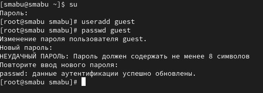{#fig:001 width=50%}

## Домашная директория

Войшел в систему от имени пользователя guest.
Определил директорию, в которой мы находимся, командой pwd (рис. [-@fig:002]):

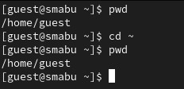{#fig:002 width=50%}

## Команда whoami

Уточнил имя  пользователя командой (рис. [-@fig:003]):

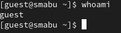{#fig:003 width=50%}

## Команды id и groups

Уточнил имя пользователя, его группу, а также группы, куда входит пользователь, командой id. Выведенные значения uid, gid и др сравнил с выводом командой groups (рис. [-@fig:004], [-@fig:005]):

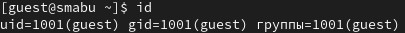{#fig:004 width=50%}

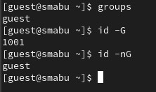{#fig:005 width=30%}

## Команда grep guest

Находил свою учётную запись. Определил uid пользователя. Определил gid пользователя и сравнил найденные значения с полученными в предыдущих пунктах (рис. [-@fig:006]):

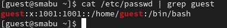{#fig:006 width=50%}

## Команда ls -l

Определил существующие в системе директории командой (рис. [-@fig:007])

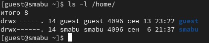{#fig:007 width=50%}

## Команда lsattr

Проверил, какие расширенные атрибуты установлены на поддиректориях, находящихся в директории /home, командой (рис. [-@fig:008]):

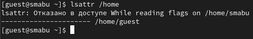{#fig:008 width=50%}

## Поддиректория dir1

Создал в домашней директории поддиректорию dir1 командой (рис. [-@fig:009]):

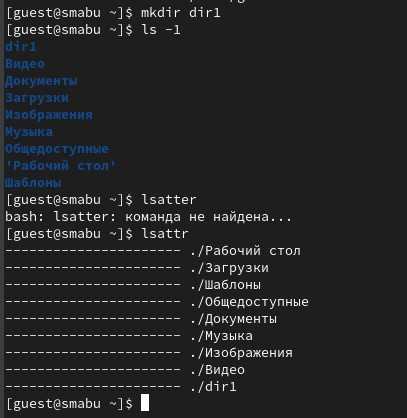{#fig:009 width=40%}

## Команда chmod

Снял с директории dir1 все атрибуты командой (рис. [-@fig:010]):

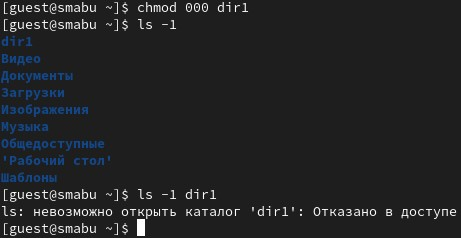{#fig:010 width=50%}

## Команда echo

Попытался создать в директории dir1 файл file1 командой (рис. [-@fig:011]):

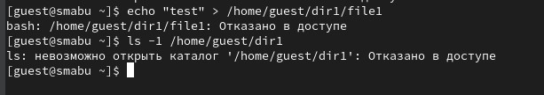{#fig:011 width=50%}

но получил отказ в выполнении операции по созданию файла.

## Минимальные права для совершения операцийя 

: Минимальные права для совершения операцийя {#tbl:tbl-1}

| Операция | Минимальные права на директорию | Минимальные права на файл |
|------------------------|-------------------|---------------------------|
| Создание файла         |        d(300)     |            (000)          |
| Удаление файла         |        d(300)     |            (000)          |
| Чтение файла           |        d(100)     |            (400)          |
| Запись в файл          |        d(100)     |            (200)          |

## Минимальные права для совершения операцийя 

: Минимальные права для совершения операцийя {#tbl:tbl-2}

| Операция | Минимальные права на директорию | Минимальные права на файл |
|------------------------|-------------------|---------------------------|
| Переименование файла   |        d(300)     |            (000)          |
| Создание поддиректории |        d(300)     |            (000)          |
| Удаление поддиректории |        d(300)     |            (000)          |

# Выводы

Получил практические навыкы работы в консоли с атрибутами файлов, закрепление теоретических основ дискреционного разграничения доступа в современных системах с открытым кодом на базе ОС Linux.

