---
## Front matter
title: "Лабораторная работа № 2"
subtitle: "Дискреционное разграничение прав в Linux. Основные атрибуты"
author: "Абу Сувейлим Мухаммед Мунифович"

## Generic otions
lang: ru-RU
toc-title: "Содержание"

## Bibliography
bibliography: bib/cite.bib
csl: pandoc/csl/gost-r-7-0-5-2008-numeric.csl

## Pdf output format
toc: true # Table of contents
toc-depth: 2
lof: true # List of figures
lot: true # List of tables
fontsize: 12pt
linestretch: 1.5
papersize: a4
documentclass: scrreprt
## I18n polyglossia
polyglossia-lang:
  name: russian
  options:
	- spelling=modern
	- babelshorthands=true
polyglossia-otherlangs:
  name: english
## I18n babel
babel-lang: russian
babel-otherlangs: english
## Fonts
mainfont: IBM Plex Serif
romanfont: IBM Plex Serif
sansfont: IBM Plex Sans
monofont: IBM Plex Mono
mathfont: STIX Two Math
mainfontoptions: Ligatures=Common,Ligatures=TeX,Scale=0.94
romanfontoptions: Ligatures=Common,Ligatures=TeX,Scale=0.94
sansfontoptions: Ligatures=Common,Ligatures=TeX,Scale=MatchLowercase,Scale=0.94
monofontoptions: Scale=MatchLowercase,Scale=0.94,FakeStretch=0.9
mathfontoptions:
## Biblatex
biblatex: true
biblio-style: "gost-numeric"
biblatexoptions:
  - parentracker=true
  - backend=biber
  - hyperref=auto
  - language=auto
  - autolang=other*
  - citestyle=gost-numeric
## Pandoc-crossref LaTeX customization
figureTitle: "Рис."
tableTitle: "Таблица"
listingTitle: "Листинг"
lofTitle: "Список иллюстраций"
lotTitle: "Список таблиц"
lolTitle: "Листинги"
## Misc options
indent: true
header-includes:
  - \usepackage{indentfirst}
  - \usepackage{float} # keep figures where there are in the text
  - \floatplacement{figure}{H} # keep figures where there are in the text
---

# Цель работы

Получение практических навыков работы в консоли с атрибутами файлов, закрепление теоретических основ дискреционного разграничения доступа в современных системах с открытым кодом на базе ОС Linux.

# Задание

Заполнить таблицу «Установленные права и разрешённые действия».

# Теоретическое введение

В метаданных каждого объекта (в inode файла/директории) содержится список разрешений на доступ к нему для разных категорий субъектов [@skillbox.ru].

Атрибуты Minimal ACL поддерживают три базовых класса субъектов доступа к файлу (класс All объединяет все три класса):

User access (u) – доступ для владельца файла;
Group access (g) – доступ для группы, владеющей файлом;
Other access (o) – доступ для остальных пользователей (кроме пользователя root).
All access (a) – доступ для всех субъектов доступа (u, g, o).
Для каждого из этих классов определены три типа разрешений:

На чтение содержимого файла (read) – символ «r».
На запись внутри файла или изменения его содержимого (write) – символ «w».
На исполнение файла (если это бинарный исполняемый файл или  файл сценария интерпретатора (execute)) – символ «x» [@tanenbaum_book_modern-os_ru].

# Выполнение лабораторной работы

В установленной при выполнении предыдущей лабораторной работы операционной системе создад учётную запись пользователя guest (использую учётную запись администратора) и задал пароль для пользователя guest (использую учётную запись администратора) (рис. [-@fig:001]):

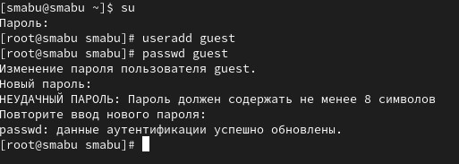{#fig:001 width=70%}

Войшел в систему от имени пользователя guest.
Определил директорию, в которой мы находимся, командой pwd (рис. [-@fig:002]):

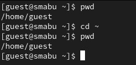{#fig:002 width=70%}

Уточнил имя  пользователя командой (рис. [-@fig:003]):

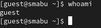{#fig:003 width=70%}

Уточнил имя пользователя, его группу, а также группы, куда входит пользователь, командой id. Выведенные значения uid, gid и др сравнил с выводом командой groups (рис. [-@fig:004], [-@fig:005]):

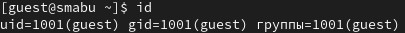{#fig:004 width=70%}

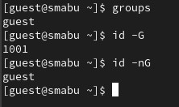{#fig:005 width=70%}

Находил свою учётную запись. Определил uid пользователя. Определил gid пользователя и сравнил найденные значения с полученными в предыдущих пунктах (рис. [-@fig:006]):

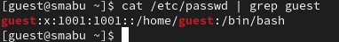{#fig:006 width=70%}

Определил существующие в системе директории командой (рис. [-@fig:007])

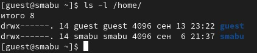{#fig:007 width=70%}

Проверил, какие расширенные атрибуты установлены на поддиректориях, находящихся в директории /home, командой (рис. [-@fig:008]):

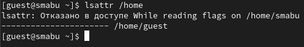{#fig:008 width=70%}

Создал в домашней директории поддиректорию dir1 командой (рис. [-@fig:009]):

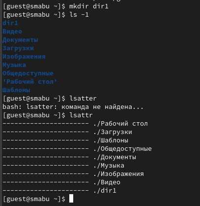{#fig:009 width=70%}

Снял с директории dir1 все атрибуты командой (рис. [-@fig:010]):

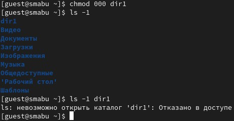{#fig:010 width=70%}

Попытался создать в директории dir1 файл file1 командой (рис. [-@fig:011]):

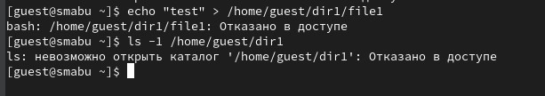{#fig:011 width=70%}

но получил отказ в выполнении операции по созданию файла.

Заполнил таблицу «Установленные права и разрешённые действия», выполняя действия от имени владельца директории (файлов), определив опытным путём, какие операции разрешены, а какие нет. Если операция разрешена, занес в таблицу знак «+», если не разрешена, знак «-».

: Установленные права и разрешённые действия {#tbl:tbl-1}

| Права директории | Права файла | Создание файла | Удаление файла | Запись в файл | Чтение файла | Смена директории | Просмотр файлов в директории | Переименование файла | Смена атрибутов файла |
|------------------------|-----------|--------|--------|--------|--------|--------|--------|--------|--------|
|   d(000)   |   (000)   |     -     |    -   |   -    |    -   |    -   |    -   |   -    |   -    |
|   d(100)   |   (000)   |     -     |    -   |   -    |    -   |    +   |    -   |   -    |   +    |
|   d(200)   |   (000)   |     -     |    -   |   -    |    -   |    -   |    -   |   -    |   -    |
|   d(300)   |   (000)   |     +     |    +   |   -    |    -   |    +   |    -   |   +    |   +    |
|   d(400)   |   (000)   |     -     |    -   |   -    |    -   |    -   |    +   |   -    |   -    |
|   d(500)   |   (000)   |     -     |    -   |   -    |    -   |    +   |    +   |   -    |   +    |
|   d(600)   |   (000)   |     -     |    -   |   -    |    -   |    -   |    +   |   -    |   -    |
|   d(700)   |   (000)   |     +     |    +   |   -    |    -   |    +   |    +   |   +    |   +    |
|   d(000)   |   (100)   |     -     |    -   |   -    |    -   |    -   |    -   |   -    |   -    |
|   d(100)   |   (100)   |     -     |    -   |   -    |    -   |    +   |    -   |   -    |   +    |
|   d(200)   |   (100)   |     -     |    -   |   -    |    -   |    -   |    -   |   -    |   -    |
|   d(300)   |   (100)   |     +     |    +   |   -    |    -   |    +   |    -   |   +    |   +    |
|   d(400)   |   (100)   |     -     |    -   |   -    |    -   |    -   |    +   |   -    |   -    |
|   d(500)   |   (100)   |     -     |    -   |   -    |    -   |    +   |    +   |   -    |   +    |
|   d(600)   |   (100)   |     -     |    -   |   -    |    -   |    -   |    +   |   -    |   -    |
|   d(700)   |   (100)   |     +     |    +   |   -    |    -   |    +   |    +   |   +    |   +    |
|   d(000)   |   (200)   |     -     |    -   |   -    |    -   |    -   |    -   |   -    |   -    |
|   d(100)   |   (200)   |     -     |    -   |   +    |    -   |    +   |    -   |   -    |   +    |
|   d(200)   |   (200)   |     -     |    -   |   -    |    -   |    -   |    -   |   -    |   -    |
|   d(300)   |   (200)   |     +     |    +   |   +    |    -   |    +   |    -   |   +    |   +    |
|   d(400)   |   (200)   |     -     |    -   |   -    |    -   |    -   |    +   |   -    |   -    |
|   d(500)   |   (200)   |     -     |    -   |   +    |    -   |    +   |    +   |   -    |   +    |
|   d(600)   |   (200)   |     -     |    -   |   -    |    -   |    -   |    +   |   -    |   -    |
|   d(700)   |   (200)   |     +     |    +   |   +    |    -   |    +   |    +   |   +    |   +    |
|   d(000)   |   (300)   |     -     |    -   |   -    |    -   |    -   |    -   |   -    |   -    |
|   d(100)   |   (300)   |     -     |    -   |   +    |    -   |    +   |    -   |   -    |   +    |
|   d(200)   |   (300)   |     -     |    -   |   -    |    -   |    -   |    -   |   -    |   -    |
|   d(300)   |   (300)   |     +     |    +   |   +    |    -   |    +   |    -   |   +    |   +    |
|   d(400)   |   (300)   |     -     |    -   |   -    |    -   |    -   |    +   |   -    |   -    |
|   d(500)   |   (300)   |     -     |    -   |   +    |    -   |    +   |    +   |   -    |   +    |
|   d(600)   |   (300)   |     -     |    -   |   -    |    -   |    -   |    +   |   -    |   -    |
|   d(700)   |   (300)   |     +     |    +   |   +    |    -   |    +   |    +   |   +    |   +    |
|   d(000)   |   (400)   |     -     |    -   |   -    |    -   |    -   |    -   |   -    |   -    |
|   d(100)   |   (400)   |     -     |    -   |   -    |    +   |    +   |    -   |   -    |   +    |
|   d(200)   |   (400)   |     -     |    -   |   -    |    -   |    -   |    -   |   -    |   -    |
|   d(300)   |   (400)   |     +     |    +   |   -    |    +   |    +   |    -   |   +    |   +    |
|   d(400)   |   (400)   |     -     |    -   |   -    |    -   |    -   |    +   |   -    |   -    |
|   d(500)   |   (400)   |     -     |    -   |   -    |    +   |    +   |    +   |   -    |   +    |
|   d(600)   |   (400)   |     -     |    -   |   -    |    -   |    -   |    +   |   -    |   -    |
|   d(700)   |   (400)   |     +     |    +   |   -    |    +   |    +   |    +   |   +    |   +    |
|   d(000)   |   (500)   |     -     |    -   |   -    |    -   |    -   |    -   |   -    |   -    |
|   d(100)   |   (500)   |     -     |    -   |   -    |    +   |    +   |    -   |   -    |   +    |
|   d(200)   |   (500)   |     -     |    -   |   -    |    -   |    -   |    -   |   -    |   -    |
|   d(300)   |   (500)   |     +     |    +   |   -    |    +   |    +   |    -   |   +    |   +    |
|   d(400)   |   (500)   |     -     |    -   |   -    |    -   |    -   |    +   |   -    |   -    |
|   d(500)   |   (500)   |     -     |    -   |   -    |    +   |    +   |    +   |   -    |   +    |
|   d(600)   |   (500)   |     -     |    -   |   -    |    -   |    -   |    +   |   -    |   -    |
|   d(700)   |   (500)   |     +     |    +   |   -    |    +   |    +   |    +   |   +    |   +    |
|   d(000)   |   (600)   |     -     |    -   |   -    |    -   |    -   |    -   |   -    |   -    |
|   d(100)   |   (600)   |     -     |    -   |   +    |    +   |    +   |    -   |   -    |   +    |
|   d(200)   |   (600)   |     -     |    -   |   -    |    -   |    -   |    -   |   -    |   -    |
|   d(300)   |   (600)   |     +     |    +   |   +    |    +   |    +   |    -   |   +    |   +    |
|   d(400)   |   (600)   |     -     |    -   |   -    |    -   |    -   |    +   |   -    |   -    |
|   d(500)   |   (600)   |     -     |    -   |   +    |    +   |    +   |    +   |   -    |   +    |
|   d(600)   |   (600)   |     -     |    -   |   -    |    -   |    -   |    +   |   -    |   -    |
|   d(700)   |   (600)   |     -     |    -   |   -    |    -   |    -   |    +   |   -    |   -    |
|   d(000)   |   (700)   |     -     |    -   |   -    |    -   |    -   |    -   |   -    |   -    |
|   d(100)   |   (700)   |     -     |    -   |   +    |    +   |    +   |    -   |   -    |   +    |
|   d(200)   |   (700)   |     -     |    -   |   -    |    -   |    -   |    -   |   -    |   -    |
|   d(300)   |   (700)   |     +     |    +   |   +    |    +   |    +   |    -   |   +    |   +    |
|   d(400)   |   (700)   |     -     |    -   |   -    |    -   |    -   |    +   |   -    |   -    |
|   d(500)   |   (700)   |     -     |    -   |   +    |    +   |    +   |    +   |   -    |   +    |
|   d(600)   |   (700)   |     -     |    -   |   -    |    -   |    -   |    +   |   -    |   -    |
|   d(700)   |   (700)   |     +     |    +   |   +    |    +   |    +   |    +   |   +    |   +    |

На основании заполненной таблицы определил те или иные минимально необходимые права для выполнения операций внутри директории dir1.

: Минимальные права для совершения операцийя {#tbl:tbl-2}

| Операция | Минимальные права на директорию | Минимальные права на файл |
|------------------------|-------------------|---------------------------|
| Создание файла         |        d(300)     |            (000)          |
| Удаление файла         |        d(300)     |            (000)          |
| Чтение файла           |        d(100)     |            (400)          |
| Запись в файл          |        d(100)     |            (200)          |
| Переименование файла   |        d(300)     |            (000)          |
| Создание поддиректории |        d(300)     |            (000)          |
| Удаление поддиректории |        d(300)     |            (000)          |

# Выводы

Получил практические навыкы работы в консоли с атрибутами файлов, закрепление теоретических основ дискреционного разграничения доступа в современных системах с открытым кодом на базе ОС Linux.

# Список литературы{.unnumbered}

::: {#refs}
:::
