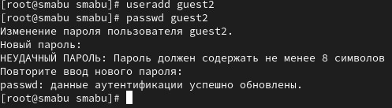
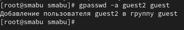
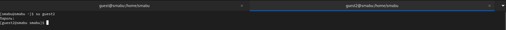
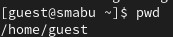
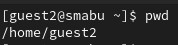
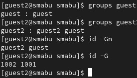
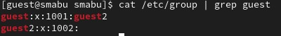
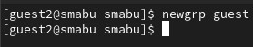
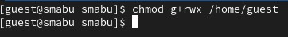

---
## Front matter
lang: ru-RU
title: Дискреционное разграничение прав в Linux. Два пользователя
subtitle: Лабораторная работа № 3
author:
  - Абу Сувейлим М. М.
institute:
  - Российский университет дружбы народов, Москва, Россия
date: 10 января 2003

## i18n babel
babel-lang: russian
babel-otherlangs: english

## Formatting pdf
toc: false
toc-title: Содержание
slide_level: 2
aspectratio: 169
section-titles: true
theme: metropolis
header-includes:
 - \metroset{progressbar=frametitle,sectionpage=progressbar,numbering=fraction}
---

# Информация

## Докладчик

:::::::::::::: {.columns align=center}
::: {.column width="70%"}

  * Абу Сувейлим Мухаммед Мунифович
  * Студент
  * Российский университет дружбы народов
  * [1032215135@pfur.ru](mailto:1032215135@pfur.ru)
  * <https://mukhammed-abu-suveilim.github.io/>

:::
::::::::::::::

# Вводная часть

## Цели и задачи

- Получение практических навыков работы в консоли с атрибутами файлов для групп пользователей.
- Заполнить таблицу «Установленные права и разрешённые действия для групп».

## Материалы и методы

1. // skillbox.ru.
2. Таненбаум Э., Бос Х. Современные операционные системы. 4-е изд. СПб.:
Питер, 2015. 1120 с.

# Выполнение лабораторной работы

## Пользователь guest2

В установленной при выполнении предыдущей лабораторной работы операционной системе создвдим учётную запись пользователя guest2 (использую учётную запись администратора) и зададим пароль для пользователя guest2 (использую учётную запись администратора) (рис. [-@fig:001]):

{#fig:001 width=50%}

## Пользователь guest2 ; группа guest

Добавем пользователя guest2 в группу guest (рис. [-@fig:002]):

{#fig:002 width=50%}

## Два консоля

Войдем в систему от двух пользователей на двух разных консолях: guest на первой консоли и guest2 на второй консоли (рис. [-@fig:003]):

{#fig:003 width=50%}

## Домашная директория guest

Определим директорию, в которой мы находимся, командой pwd (рис. [-@fig:004], [-@fig:005]):

{#fig:004 width=40%}

{#fig:005 width=40%}

## Команда groups

Уточнил имя пользователя, его группу, а также группы, куда входит пользователь, командой id. Выведенные значения uid, gid и др сравнил с выводом командой groups рис. [-@fig:006]:

{#fig:006 width=50%}

## Команда grep guest

Находил свою учётную запись. Определил uid пользователя. Определил gid пользователя и сравнил найденные значения с полученными в предыдущих пунктах (рис. [-@fig:007]):

{#fig:007 width=50%}

## Команда newgrp

От имени пользователя guest2 выполним регистрацию пользователя
guest2 в группе guest командой (рис. [-@fig:008])

{#fig:008 width=70%}

## Команда chmod

От имени пользователя guest измените права директории /home/guest,
разрешив все действия для пользователей группы (рис. [-@fig:009]):

{#fig:009 width=50%}

## Установленные права и разрешённые действия для групп 

: Установленные права и разрешённые действия для групп  {#tbl:tbl-1}

| Права директории | Права файла | Создание файла | Удаление файла | Запись в файл | Чтение файла | Смена директории | Просмотр файлов в директории | Переименование файла | Смена атрибутов файла |
|------------------------|-----------|--------|--------|--------|--------|--------|--------|--------|--------|
|   d(000)   |   (000)   |     -     |    -   |   -    |    -   |    -   |    -   |   -    |   -    |
|   d(030)   |   (030)   |     +     |    +   |   +    |    -   |    +   |    -   |   +    |   -    |
|   d(050)   |   (050)   |     -     |    -   |   -    |    +   |    +   |    +   |   -    |   -    |
|   d(070)   |   (070)   |     +     |    +   |   +    |    +   |    +   |    +   |   +    |   -    |

## Минимальные права для совершения операцийя 

: Минимальные права для совершения операцийя {#tbl:tbl-2}

| Операция | Минимальные права на директорию | Минимальные права на файл |
|------------------------|-------------------|---------------------------|
| Создание файла         |        d(030)     |            (000)          |
| Удаление файла         |        d(030)     |            (000)          |
| Чтение файла           |        d(010)     |            (040)          |
| Запись в файл          |        d(010)     |            (020)          |

## Минимальные права для совершения операцийя 

: Минимальные права для совершения операцийя {#tbl:tbl-3}

| Операция | Минимальные права на директорию | Минимальные права на файл |
|------------------------|-------------------|---------------------------|
| Переименование файла   |        d(030)     |            (000)          |
| Создание поддиректории |        d(030)     |            (000)          |
| Удаление поддиректории |        d(030)     |            (000)          |

# Выводы

Получил практические навыкы работы в консоли с атрибутами файлов для групп пользователей.
