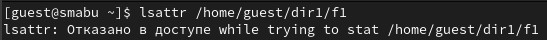
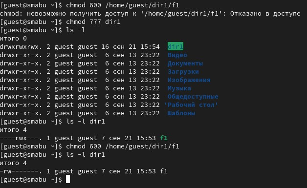
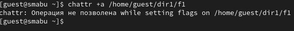
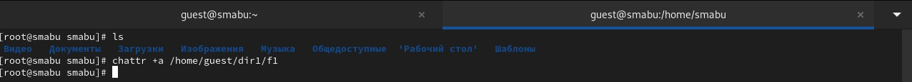
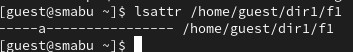
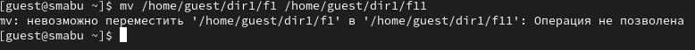
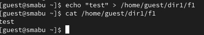
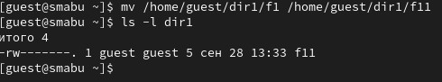
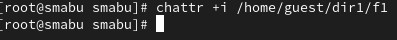
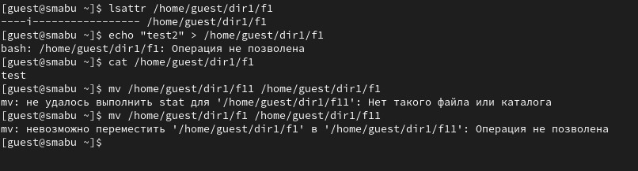

---
## Front matter
## Front matter
lang: ru-RU
title: Дискреционное разграничение прав в Linux. Расширенные атрибуты
subtitle: Лабораторная работа № 4
author:
  - Абу Сувейлим М. М.
institute:
  - Российский университет дружбы народов, Москва, Россия
date: 10 января 2003
## i18n babel
babel-lang: russian
babel-otherlangs: english

## Formatting pdf
toc: false
toc-title: Содержание
slide_level: 2
aspectratio: 169
section-titles: true
theme: metropolis
header-includes:
 - \metroset{progressbar=frametitle,sectionpage=progressbar,numbering=fraction}
---

# Информация

## Докладчик

:::::::::::::: {.columns align=center}
::: {.column width="70%"}

  * Абу Сувейлим Мухаммед Мунифович
  * Студент
  * Российский университет дружбы народов
  * [1032215135@pfur.ru](mailto:1032215135@pfur.ru)
  * <https://mukhammed-abu-suveilim.github.io/>

:::
::::::::::::::

# Вводная часть

## Цели и задачи

- Получение практических навыков работы в консоли с расширенными атрибутами файлов. 
- Использовать интерфейс командой строки (CLI) при выполнении лабораторной работы.

## Материалы и методы

1. // skillbox.ru.
2. Таненбаум Э., Бос Х. Современные операционные системы. 4-е изд. СПб.:
Питер, 2015. 1120 с.

# Выполнение лабораторной работы

## Команда lsattr

От имени пользователя guest хотели определить расширенные атрибуты файла
/home/guest/dir1/f1 командой (рис. [-@fig:001]):

{#fig:001 width=70%}

но получили отказ.

## Команда chmod

Установили командой chmod 600 f1 на файл f1 права, разрешающие чтение и запись для владельца файла (рис. [-@fig:002]):

{#fig:002 width=50%}

## Команда chattr +a

Попробавли установить на файл /home/guest/dir1/f1 расширенный атрибут a от имени пользователя guest (рис. [-@fig:003]):

{#fig:003 width=70%}

В ответ мы получили отказ от выполнения операции.

## Команда chattr +a через root

Повысили свои права с помощью команды su. Попробавли установить расширенный атрибут a на файл /home/guest/dir1/f1 от имени суперпользователя (рис. [-@fig:004]):

{#fig:004 width=70%}

## Команда lsattr f1 на guest

От пользователя guest проверbkb правильность установления атрибута (рис. [-@fig:005]):

{#fig:005 width=70%}

## Команда echo > f1 на guest

Выполним дозапись в файл f1 слова «test» командой (рис. [-@fig:006]):

{#fig:006 width=70%}

## Команда cat f1 на guest

После этого выполним чтение файла file1 командой (рис. [-@fig:007]):

{#fig:007 width=70%}

## Команда mv f1 f11

Переименовать файл f1 невозможно (рис. [-@fig:008]):

{#fig:008 width=70%}

## Команда chattr -a

После снятии расширенный атрибут a с файла /home/guest/dirl/f1 от
имени суппользователя командой (рис. [-@fig:009]):

{#fig:009 width=70%}

## Команды echo и mv 1

Все команды, которые мы не смогли выполнить выполнялись (рис. [-@fig:010], [-@fig:011]):

{#fig:010 width=50%}

{#fig:011 width=50%}

## Команда chattr +i

Повторим наши действия по шагам, заменив атрибут «a» атрибутом «i» (рис. [-@fig:012]):

{#fig:012 width=70%}

## Команды echo и mv 2

Получили отказ (рис. [-@fig:013]):

{#fig:013 width=50%}

# Выводы

В результате выполнения работы мы повысили свои навыки использования интерфейса командой строки(CLI), познакомились на примерах с тем, как используются основные и расширенные атрибуты при разграничении доступа. Имели возможность связать теорию дискреционного разделения доступа (дискреционная политика безопасности) с её реализацией на практике в ОС Linux. Составили наглядные таблицы, поясняющие какие операции возможны при тех или иных установленных правах. Опробовали действие на практике расширенных атрибутов «а» и «i».