---
## Front matter
title: "Лабораторная работа № 4"
subtitle: "Дискреционное разграничение прав в Linux. Расширенные атрибуты"
author: "Абу Сувейлим Мухаммед Мунифович"

## Generic otions
lang: ru-RU
toc-title: "Содержание"

## Bibliography
bibliography: bib/cite.bib
csl: pandoc/csl/gost-r-7-0-5-2008-numeric.csl

## Pdf output format
toc: true # Table of contents
toc-depth: 2
lof: true # List of figures
lot: true # List of tables
fontsize: 12pt
linestretch: 1.5
papersize: a4
documentclass: scrreprt
## I18n polyglossia
polyglossia-lang:
  name: russian
  options:
	- spelling=modern
	- babelshorthands=true
polyglossia-otherlangs:
  name: english
## I18n babel
babel-lang: russian
babel-otherlangs: english
## Fonts
mainfont: IBM Plex Serif
romanfont: IBM Plex Serif
sansfont: IBM Plex Sans
monofont: IBM Plex Mono
mathfont: STIX Two Math
mainfontoptions: Ligatures=Common,Ligatures=TeX,Scale=0.94
romanfontoptions: Ligatures=Common,Ligatures=TeX,Scale=0.94
sansfontoptions: Ligatures=Common,Ligatures=TeX,Scale=MatchLowercase,Scale=0.94
monofontoptions: Scale=MatchLowercase,Scale=0.94,FakeStretch=0.9
mathfontoptions:
## Biblatex
biblatex: true
biblio-style: "gost-numeric"
biblatexoptions:
  - parentracker=true
  - backend=biber
  - hyperref=auto
  - language=auto
  - autolang=other*
  - citestyle=gost-numeric
## Pandoc-crossref LaTeX customization
figureTitle: "Рис."
tableTitle: "Таблица"
listingTitle: "Листинг"
lofTitle: "Список иллюстраций"
lotTitle: "Список таблиц"
lolTitle: "Листинги"
## Misc options
indent: true
header-includes:
  - \usepackage{indentfirst}
  - \usepackage{float} # keep figures where there are in the text
  - \floatplacement{figure}{H} # keep figures where there are in the text
---

# Цель работы

Получение практических навыков работы в консоли с расширенными
атрибутами файлов. 

# Задание

Использовать интерфейс командой строки (CLI) при выполнении лабораторной работы

# Теоретическое введение

В метаданных каждого объекта (в inode файла/директории) содержится список разрешений на доступ к нему для разных категорий субъектов [@skillbox.ru].

Атрибуты Minimal ACL поддерживают три базовых класса субъектов доступа к файлу (класс All объединяет все три класса):

User access (u) – доступ для владельца файла;
Group access (g) – доступ для группы, владеющей файлом;
Other access (o) – доступ для остальных пользователей (кроме пользователя root).
All access (a) – доступ для всех субъектов доступа (u, g, o).
Для каждого из этих классов определены три типа разрешений:

На чтение содержимого файла (read) – символ «r».
На запись внутри файла или изменения его содержимого (write) – символ «w».
На исполнение файла (если это бинарный исполняемый файл или  файл сценария интерпретатора (execute)) – символ «x» [@tanenbaum_book_modern-os_ru].

# Выполнение лабораторной работы

От имени пользователя guest хотели определить расширенные атрибуты файла
/home/guest/dir1/f1 командой (рис. [-@fig:001]):

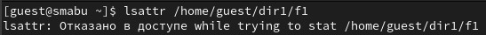{#fig:001 width=70%}

но получили отказ.

Установили командой chmod 600 f1 на файл f1 права, разрешающие чтение и запись для владельца файла (рис. [-@fig:002]):

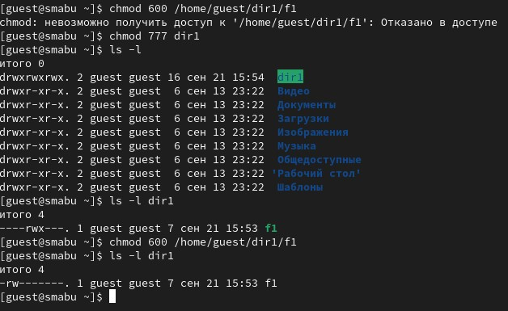{#fig:002 width=70%}

Попробавли установить на файл /home/guest/dir1/f1 расширенный атрибут a от имени пользователя guest (рис. [-@fig:003]):

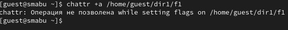{#fig:003 width=70%}

В ответ мы получили отказ от выполнения операции.

Повысили свои права с помощью команды su. Попробавли установить расширенный атрибут a на файл /home/guest/dir1/f1 от имени суперпользователя (рис. [-@fig:004]):

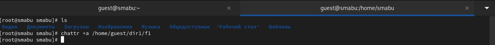{#fig:004 width=70%}

От пользователя guest проверbkb правильность установления атрибута (рис. [-@fig:005]):

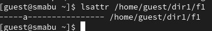{#fig:005 width=70%}

Выполним дозапись в файл f1 слова «test» командой (рис. [-@fig:006]):

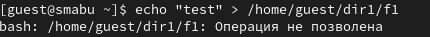{#fig:006 width=70%}

После этого выполним чтение файла file1 командой (рис. [-@fig:007]):

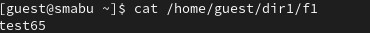{#fig:007 width=70%}

Переименовать файл f1 невозможно (рис. [-@fig:008]):

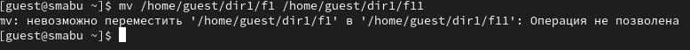{#fig:008 width=70%}

После снятии расширенный атрибут a с файла /home/guest/dirl/f1 от
имени суппользователя командой (рис. [-@fig:009]):

{#fig:009 width=70%}

Все команды, которые мы не смогли выполнить выполнялись (рис. [-@fig:010], [-@fig:011]):

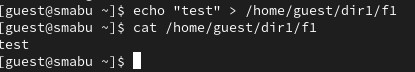{#fig:010 width=70%}

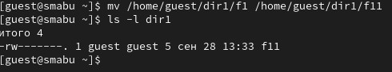{#fig:011 width=70%}

Повторим наши действия по шагам, заменив атрибут «a» атрибутом «i» (рис. [-@fig:012]):

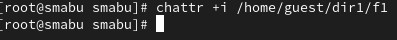{#fig:012 width=70%}

Получили отказ (рис. [-@fig:013]):

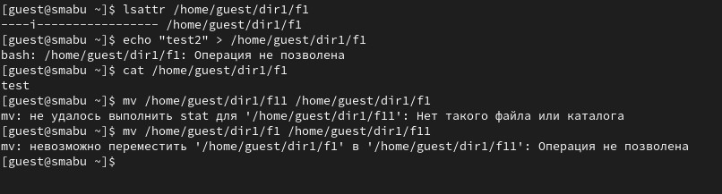{#fig:013 width=70%}

# Выводы

В результате выполнения работы мы повысили свои навыки использования интерфейса командой строки(CLI), познакомились на примерах с тем, как используются основные и расширенные атрибуты при разграничении доступа. Имели возможность связать теорию дискреционного разделения доступа (дискреционная политика безопасности) с её реализацией на практике в ОС Linux. Составили наглядные таблицы, поясняющие какие операции возможны при тех или иных установленных правах. Опробовали действие на практике расширенных атрибутов «а» и «i».

# Список литературы{.unnumbered}

::: {#refs}
:::
