---
## Front matter
lang: ru-RU
title: Дискреционное разграничение прав в Linux. Исследование влияния дополнительных атрибутов
subtitle: Лабораторная работа № 5
author:
  - Абу Сувейлим М. М.
institute:
  - Российский университет дружбы народов, Москва, Россия
date: 10 января 2003

## i18n babel
babel-lang: russian
babel-otherlangs: english

## Formatting pdf
toc: false
toc-title: Содержание
slide_level: 2
aspectratio: 169
section-titles: true
theme: metropolis
header-includes:
 - \metroset{progressbar=frametitle,sectionpage=progressbar,numbering=fraction}
---

# Информация

## Докладчик

:::::::::::::: {.columns align=center}
::: {.column width="70%"}

  * Абу Сувейлим Мухаммед Мунифович
  * Студент
  * Российский университет дружбы народов
  * [1032215135@pfur.ru](mailto:1032215135@pfur.ru)
  * <https://mukhammed-abu-suveilim.github.io/>

:::
::::::::::::::

# Вводная часть

## Цели и задачи

- Изучение механизмов изменения идентификаторов, применения SetUID- и Sticky-битов. Получение практических навыков работы в консоли с дополнительными атрибутами. Рассмотрение работы механизма смены идентификатора процессов пользователей, а также влияние бита Sticky на запись и удаление файлов.
- Создание программы и исследование Sticky-бита.

## Материалы и методы

1. // skillbox.ru.
2. Таненбаум Э., Бос Х. Современные операционные системы. 4-е изд. СПб.:
Питер, 2015. 1120 с.

# Выполнение лабораторной работы

## Компилятор gcc

Проверяем, что у нас установлен компилятор gcc командой (рис. [-@fig:001]):

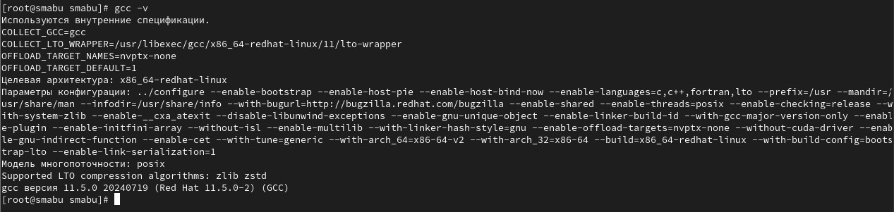{#fig:001 width=50%}

## Команда setenforce

Далее, отключим систему запретов до очередной перезагрузки системы командой (рис. [-@fig:002]):

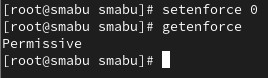{#fig:002 width=50%}

## Программа simpleid.c

Войдем в систему от имени пользователя guest и создадим программу simpleid.c (рис. [-@fig:003]):

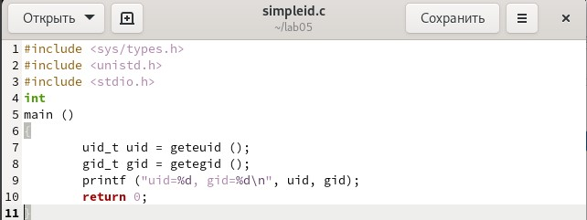{#fig:003 width=50%}

## Запуск программы simpleid.c

Скомплилируйем программу и убедимся, что файл программы создан (рис. [-@fig:004]):

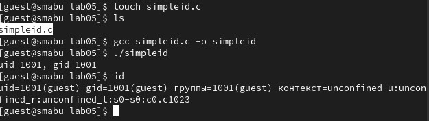{#fig:004 width=50%}

Выполним программу simpleid и системную программу id. Видем, что полученный нами результат с данными предыдущего пункта задания и этого пункта задания совпадают.

## Программа simpleid2.c

Усложним программу, добавив вывод действительных идентификаторов (рис. [-@fig:005]):

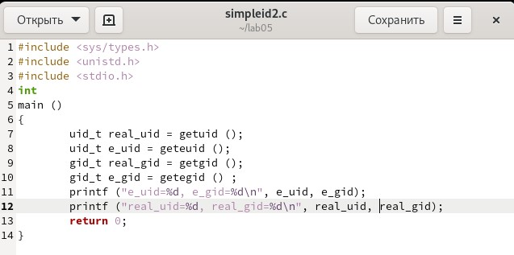{#fig:005 width=50%}

## Запуск программы simpleid2.c

Скомпилируйем и запустим simpleid2.c (рис. [-@fig:006]):

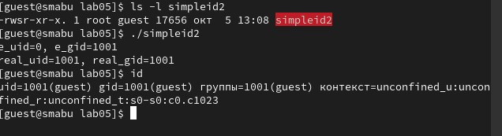{#fig:006 width=50%}

## Команды chown и chmod

От имени суперпользователя выполним команды: 

```bash
chown root:guest /home/guest/simpleid2
chmod u+s /home/guest/simpleid2
```

## Проверка правильности установки новых атрибутов

Выполним проверку правильности установки новых атрибутов и смены владельца файла simpleid2 и запустим simpleid2 и id (рис. [-@fig:007]):

{#fig:007 width=50%}

## Программа readfile.c

Создаим программу readfile.c (рис. [-@fig:008]):

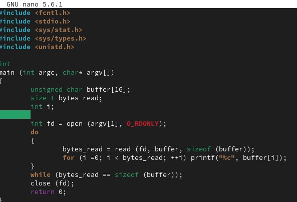{#fig:008 width=50%}

## Смена владельца у файла readfile.c

Смените владельца у файла readfile.c (или любого другого текстового
файла в системе) и измените права так, чтобы только суперпользователь
(root) мог прочитать его, a guest не мог. (рис. [-@fig:009]):

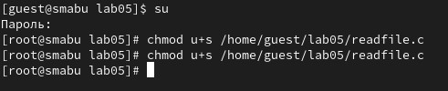{#fig:009 width=50%}

## Чтения файла readfile.c

Программа readfile неможет прочитать файл readfile.c и неможет ипрочитать файл /etc/shadow (рис. [-@fig:010]) 

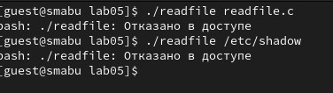{#fig:010 width=50%}

## Команда grep

Выясним, установлен ли атрибут Sticky на директории /tmp, для чего выполним команду (рис. [-@fig:011]): 

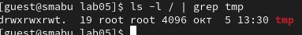{#fig:011 width=50%}

## Файл file01.txt

От имени пользователя guest создадим файл file01.txt в директории /tmp
со словом test (рис. [-@fig:012]):

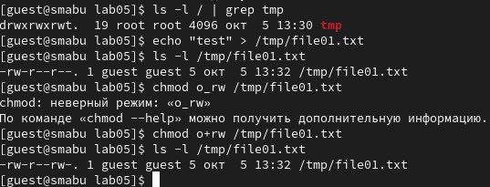{#fig:012 width=50%}

Просмотрим атрибуты у только что созданного файла и разрешите чтение и запись для категории пользователей «все остальные» (рис. [-@fig:012]). 

## Чтения файла file01.txt от пользователя guest2

От пользователя guest2 (не являющегося владельцем) попробуйм прочитать файл /tmp/file01.txt (рис. [-@fig:013]):

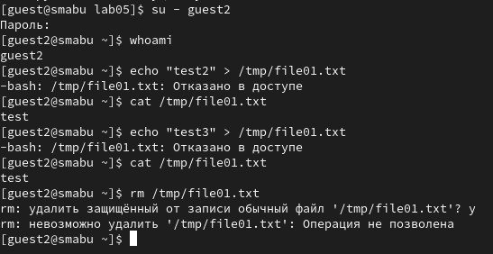{#fig:013 width=50%}

## Проверка файла file01.txt

Попробуйм дозаписать в файл /tmp/file01.txt слово test2 командой (рис. [-@fig:013]). Проверем содержимое файла командой (рис. [-@fig:013]). От пользователя guest2 попробуйм записать в файл /tmp/file01.txt слово test3, стерев при этом всю имеющуюся в файле информацию командой (рис. [-@fig:013]). Проверем содержимое файла и попробуйм удалить файл /tmp/file01.txt командой (рис. [-@fig:013]). 

## Команда chmod -t /tmp

Выполним после этого команду, снимающую атрибут t (Sticky-бит) с директории /tmp (рис. [-@fig:014]):

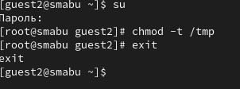{#fig:014 width=50%}

## Команда chmod -t /tmp

От пользователя guest2 проверем, что атрибута t у директории /tmp нет (рис. [-@fig:015]): 

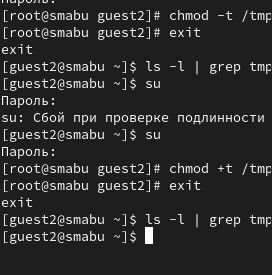{#fig:015 width=30%}

# Выводы

Изучали механизмы изменения идентификаторов, применения SetUID- и Sticky-битов. Получили практические навыки работы в консоли с дополнительными атрибутами. Рассмотрели работы механизма
смены идентификатора процессов пользователей, а также влияние бита Sticky на запись и удаление файлов кратко описываются итоги проделанной работы.