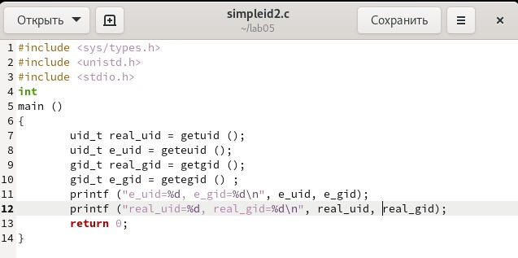

---
## Front matter
title: "Лабораторная работа № 5"
subtitle: "Дискреционное разграничение прав в Linux. Исследование влияния дополнительных атрибутов"
author: "Абу Сувейлим Мухаммед Мунифович"

## Generic otions
lang: ru-RU
toc-title: "Содержание"

## Bibliography
bibliography: bib/cite.bib
csl: pandoc/csl/gost-r-7-0-5-2008-numeric.csl

## Pdf output format
toc: true # Table of contents
toc-depth: 2
lof: true # List of figures
lot: true # List of tables
fontsize: 12pt
linestretch: 1.5
papersize: a4
documentclass: scrreprt
## I18n polyglossia
polyglossia-lang:
  name: russian
  options:
	- spelling=modern
	- babelshorthands=true
polyglossia-otherlangs:
  name: english
## I18n babel
babel-lang: russian
babel-otherlangs: english
## Fonts
mainfont: IBM Plex Serif
romanfont: IBM Plex Serif
sansfont: IBM Plex Sans
monofont: IBM Plex Mono
mathfont: STIX Two Math
mainfontoptions: Ligatures=Common,Ligatures=TeX,Scale=0.94
romanfontoptions: Ligatures=Common,Ligatures=TeX,Scale=0.94
sansfontoptions: Ligatures=Common,Ligatures=TeX,Scale=MatchLowercase,Scale=0.94
monofontoptions: Scale=MatchLowercase,Scale=0.94,FakeStretch=0.9
mathfontoptions:
## Biblatex
biblatex: true
biblio-style: "gost-numeric"
biblatexoptions:
  - parentracker=true
  - backend=biber
  - hyperref=auto
  - language=auto
  - autolang=other*
  - citestyle=gost-numeric
## Pandoc-crossref LaTeX customization
figureTitle: "Рис."
tableTitle: "Таблица"
listingTitle: "Листинг"
lofTitle: "Список иллюстраций"
lotTitle: "Список таблиц"
lolTitle: "Листинги"
## Misc options
indent: true
header-includes:
  - \usepackage{indentfirst}
  - \usepackage{float} # keep figures where there are in the text
  - \floatplacement{figure}{H} # keep figures where there are in the text
---

# Цель работы

Изучение механизмов изменения идентификаторов, применения SetUID- и Sticky-битов. Получение практических навыков работы в консоли с дополнительными атрибутами. Рассмотрение работы механизма смены идентификатора процессов пользователей, а также влияние бита Sticky на запись и удаление файлов.

# Задание

Создание программы и исследование Sticky-бита


# Теоретическое введение

В метаданных каждого объекта (в inode файла/директории) содержится список разрешений на доступ к нему для разных категорий субъектов [@skillbox.ru].

Атрибуты Minimal ACL поддерживают три базовых класса субъектов доступа к файлу (класс All объединяет все три класса):

User access (u) – доступ для владельца файла;
Group access (g) – доступ для группы, владеющей файлом;
Other access (o) – доступ для остальных пользователей (кроме пользователя root).
All access (a) – доступ для всех субъектов доступа (u, g, o).
Для каждого из этих классов определены три типа разрешений:

На чтение содержимого файла (read) – символ «r».
На запись внутри файла или изменения его содержимого (write) – символ «w».
На исполнение файла (если это бинарный исполняемый файл или  файл сценария интерпретатора (execute)) – символ «x» [@tanenbaum_book_modern-os_ru].


# Выполнение лабораторной работы

Проверяем, что у нас установлен компилятор gcc командой (рис. [-@fig:001]):

{#fig:001 width=70%}

Далее, отключим систему запретов до очередной перезагрузки системы командой (рис. [-@fig:002]):

{#fig:002 width=70%}

Войдем в систему от имени пользователя guest и создадим программу simpleid.c (рис. [-@fig:003]):

{#fig:003 width=70%}

Скомплилируйем программу и убедимся, что файл программы создан (рис. [-@fig:004]):

{#fig:004 width=70%}

Выполним программу simpleid и системную программу id. Видем, что полученный нами результат с данными предыдущего пункта задания и этого пункта задания совпадают.

Усложним программу, добавив вывод действительных идентификаторов (рис. [-@fig:005]):

{#fig:005 width=70%}

Скомпилируйем и запустим simpleid2.c (рис. [-@fig:006]):

{#fig:006 width=70%}

От имени суперпользователя выполним команды: 
```bash
chown root:guest /home/guest/simpleid2
chmod u+s /home/guest/simpleid2
```
Выполним проверку правильности установки новых атрибутов и смены владельца файла simpleid2 и запустим simpleid2 и id (рис. [-@fig:007]):

{#fig:007 width=70%}

Создаим программу readfile.c (рис. [-@fig:008]):

{#fig:008 width=70%}

Смените владельца у файла readfile.c (или любого другого текстового
файла в системе) и измените права так, чтобы только суперпользователь
(root) мог прочитать его, a guest не мог. (рис. [-@fig:009]):

{#fig:009 width=70%}

Программа readfile неможет прочитать файл readfile.c и неможет ипрочитать файл /etc/shadow (рис. [-@fig:010]) 

{#fig:010 width=70%}

Выясним, установлен ли атрибут Sticky на директории /tmp, для чего выполним команду (рис. [-@fig:011]): 

{#fig:011 width=70%}

От имени пользователя guest создадим файл file01.txt в директории /tmp
со словом test (рис. [-@fig:012]):

{#fig:012 width=70%}

Просмотрим атрибуты у только что созданного файла и разрешите чтение и запись для категории пользователей «все остальные» (рис. [-@fig:012]). 

От пользователя guest2 (не являющегося владельцем) попробуйм прочитать файл /tmp/file01.txt (рис. [-@fig:013]):

{#fig:013 width=70%}

Попробуйм дозаписать в файл /tmp/file01.txt слово test2 командой (рис. [-@fig:013]). Проверем содержимое файла командой (рис. [-@fig:013]). От пользователя guest2 попробуйм записать в файл /tmp/file01.txt слово test3, стерев при этом всю имеющуюся в файле информацию командой (рис. [-@fig:013]). Проверем содержимое файла и попробуйм удалить файл /tmp/file01.txt командой (рис. [-@fig:013]). 

Выполним после этого команду, снимающую атрибут t (Sticky-бит) с директории /tmp (рис. [-@fig:014]):

{#fig:014 width=70%}

От пользователя guest2 проверем, что атрибута t у директории /tmp нет (рис. [-@fig:015]): 

{#fig:015 width=70%}

# Выводы

Изучали механизмы изменения идентификаторов, применения SetUID- и Sticky-битов. Получили практические навыки работы в консоли с дополнительными атрибутами. Рассмотрели работы механизма
смены идентификатора процессов пользователей, а также влияние бита Sticky на запись и удаление файлов кратко описываются итоги проделанной работы.

# Список литературы{.unnumbered}

::: {#refs}
:::
