---
## Front matter
lang: ru-RU
title: Мандатное разграничение прав в Linux
subtitle: Лабораторная работа № 6
author:
  - Абу Сувейлим М. М.
institute:
  - Российский университет дружбы народов, Москва, Россия
date: 10 января 2003

## i18n babel
babel-lang: russian
babel-otherlangs: english

## Formatting pdf
toc: false
toc-title: Содержание
slide_level: 2
aspectratio: 169
section-titles: true
theme: metropolis
header-includes:
 - \metroset{progressbar=frametitle,sectionpage=progressbar,numbering=fraction}
---

# Информация

## Докладчик

:::::::::::::: {.columns align=center}
::: {.column width="70%"}

  * Абу Сувейлим Мухаммед Мунифович
  * Студент
  * Российский университет дружбы народов
  * [1032215135@pfur.ru](mailto:1032215135@pfur.ru)
  * <https://mukhammed-abu-suveilim.github.io/>

:::
::::::::::::::

# Вводная часть

## Цели и задачи

- Развить навыки администрирования ОС Linux. Получить первое практическое знакомство с технологией SELinux.
Проверить работу SELinx на практике совместно с веб-сервером Apache.

## Материалы и методы

- Таненбаум Э., Бос Х. Современные операционные системы. 4-е изд. СПб.:
Питер, 2015. 1120 с.

# Выполнение лабораторной работы

## Коианда getenforce

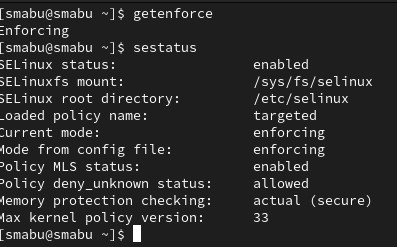{#fig:001 width=60%}

## Коианда service httpd status

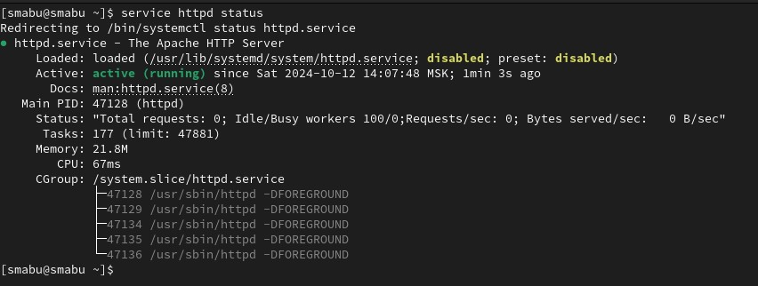{#fig:002 width=60%}

## Коианда ps -eZ | grep httpd

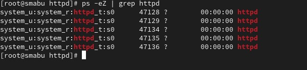{#fig:003 width=60%}

## Коианда sestatus -b | grep httpd

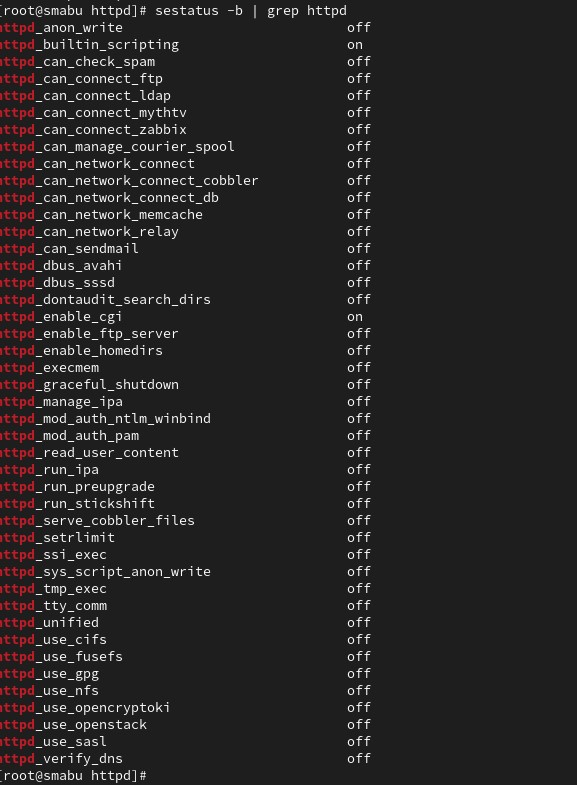{#fig:004 width=60%}

## Коианда seinfo

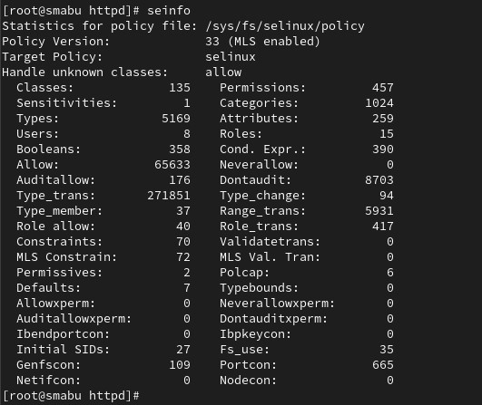{#fig:005 width=60%}

## Коианда ls -lZ /var/www

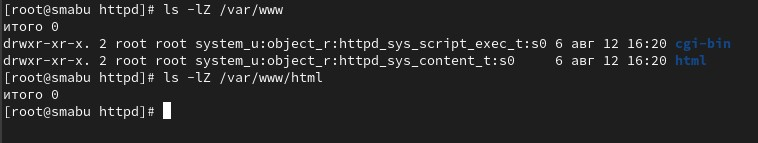{#fig:006 width=60%}

## html-файл test.html

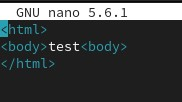{#fig:007 width=60%}
 
## html-файл test.html 2

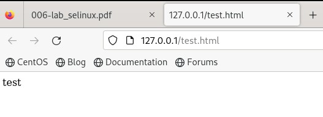{#fig:008 width=60%}

## Коианда man httpd

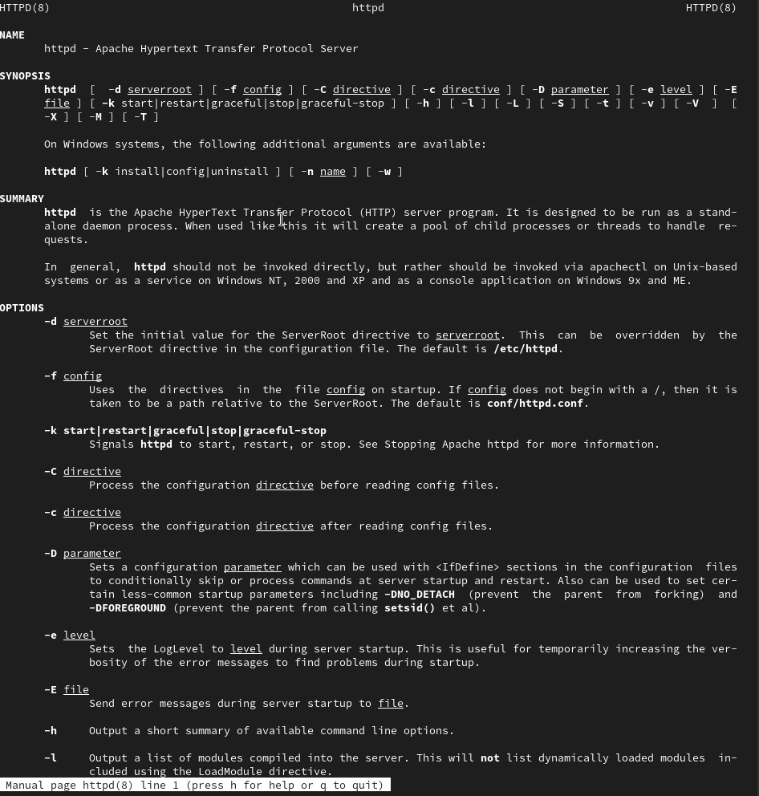{#fig:009 width=60%}

## Коианда chcon

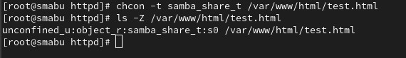{#fig:010 width=60%}

## Ошибка Forbidden

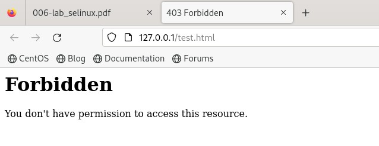{#fig:011 width=60%}

## Команда ls -l /var/www/html/test.html

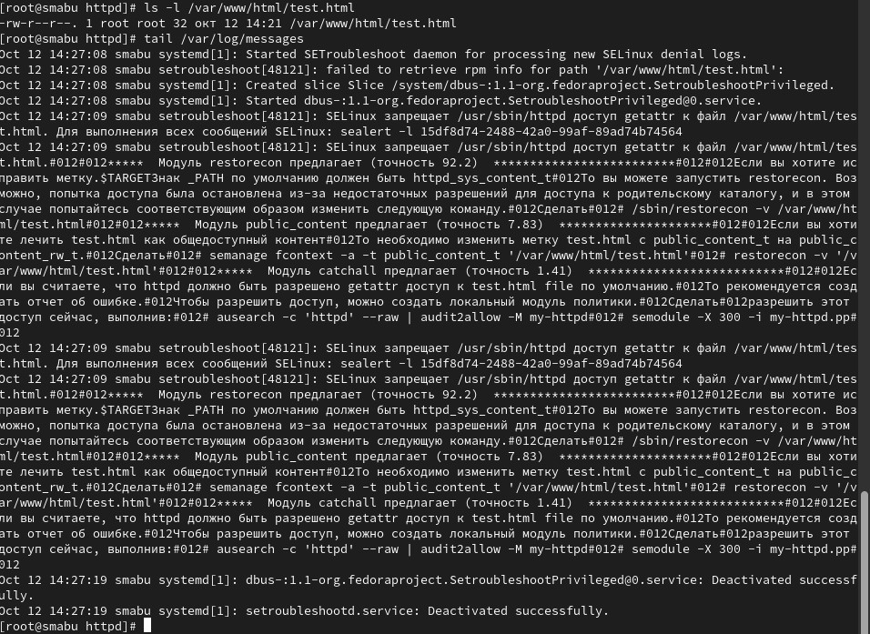{#fig:012 width=60%}

## Лог-файлы

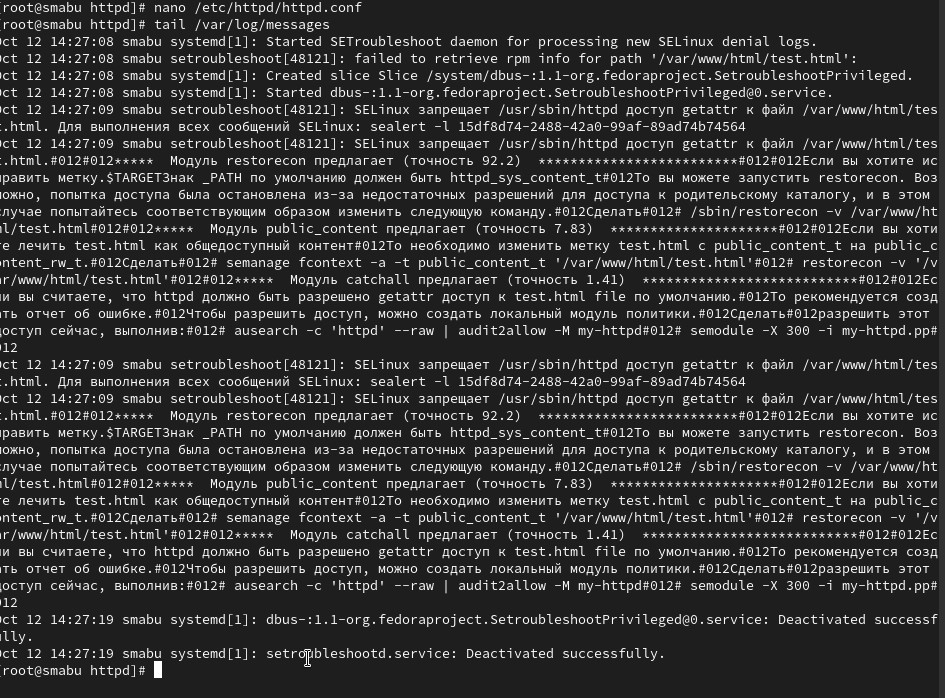{#fig:013 width=60%}

## Команда semanage

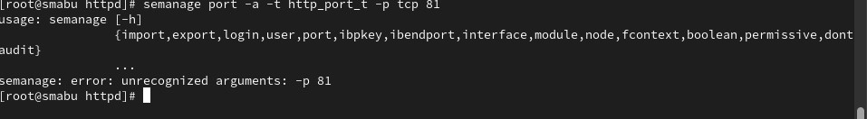{#fig:014 width=60%}

## Команда rm /var/www/html/test.html

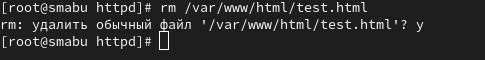{#fig:015 width=60%}

# Выводы

Развивли свои навыки администрирования ОС Linux. Получить первое практическое знакомство с технологией SELinux1. Проверили работу SELinx на практике совместно с веб-сервером
Apache.