---
### Front matter
title: "Лабораторная работа № 6"
subtitle: "Мандатное разграничение прав в Linux"
author: "Абу Сувейлим Мухаммед Мунифович"

## Generic otions
lang: ru-RU
toc-title: "Содержание"

## Bibliography
bibliography: bib/cite.bib
csl: pandoc/csl/gost-r-7-0-5-2008-numeric.csl

## Pdf output format
toc: true # Table of contents
toc-depth: 2
lof: true # List of figures
lot: true # List of tables
fontsize: 12pt
linestretch: 1.5
papersize: a4
documentclass: scrreprt
## I18n polyglossia
polyglossia-lang:
  name: russian
  options:
	- spelling=modern
	- babelshorthands=true
polyglossia-otherlangs:
  name: english
## I18n babel
babel-lang: russian
babel-otherlangs: english
## Fonts
mainfont: IBM Plex Serif
romanfont: IBM Plex Serif
sansfont: IBM Plex Sans
monofont: IBM Plex Mono
mathfont: STIX Two Math
mainfontoptions: Ligatures=Common,Ligatures=TeX,Scale=0.94
romanfontoptions: Ligatures=Common,Ligatures=TeX,Scale=0.94
sansfontoptions: Ligatures=Common,Ligatures=TeX,Scale=MatchLowercase,Scale=0.94
monofontoptions: Scale=MatchLowercase,Scale=0.94,FakeStretch=0.9
mathfontoptions:
## Biblatex
biblatex: true
biblio-style: "gost-numeric"
biblatexoptions:
  - parentracker=true
  - backend=biber
  - hyperref=auto
  - language=auto
  - autolang=other*
  - citestyle=gost-numeric
## Pandoc-crossref LaTeX customization
figureTitle: "Рис."
tableTitle: "Таблица"
listingTitle: "Листинг"
lofTitle: "Список иллюстраций"
lotTitle: "Список таблиц"
lolTitle: "Листинги"
## Misc options
indent: true
header-includes:
  - \usepackage{indentfirst}
  - \usepackage{float} # keep figures where there are in the text
  - \floatplacement{figure}{H} # keep figures where there are in the text
---

# Цель работы

Развить навыки администрирования ОС Linux. Получить первое практическое знакомство с технологией SELinux.
Проверить работу SELinx на практике совместно с веб-сервером Apache.

# Задание

Для проведения указанной лабораторной работы на одно рабочее место требуется компьютер с установленной операционной системой Linux,
поддерживающей технологию SELinux.
Предполагается использовать стандартный дистрибутив Linux CentOS с включённой политикой SELinux targeted и режимом enforcing. Для выполнения заданий требуется наличие учётной записи администратора (root) и
учётной записи обычного пользователя. Постоянно работать от учётной записи root неправильно с точки зрения безопасности [@tanenbaum_book_modern-os_ru]

# Выполнение лабораторной работы

Войдите в систему с полученными учётными данными и убедитесь, что
SELinux работает в режиме enforcing политики targeted с помощью команд getenforce и sestatus. (рис. [-@fig:001]).

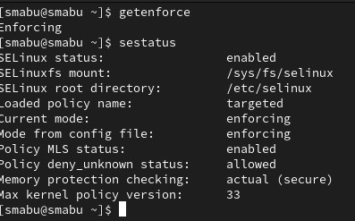{#fig:001 width=70%}

Обратитесь с помощью браузера к веб-серверу, запущенному на вашем компьютере, и убедитесь, что последний работает:
service httpd status
или
/etc/rc.d/init.d/httpd status
Если не работает, запустите его так же, но с параметром start. (рис. [-@fig:002]):

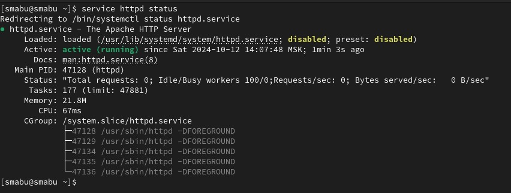{#fig:002 width=70%}

Найдите веб-сервер Apache в списке процессов, определите его контекст
безопасности и занесите эту информацию в отчёт. Например, можно использовать команду
ps auxZ | grep httpd или ps -eZ | grep httpd (рис. [-@fig:003]):

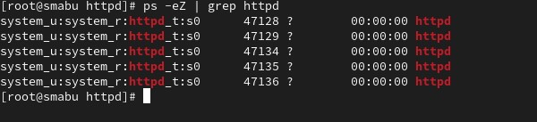{#fig:003 width=70%}

Посмотрите текущее состояние переключателей SELinux для Apache с помощью команды (рис. [-@fig:004]):

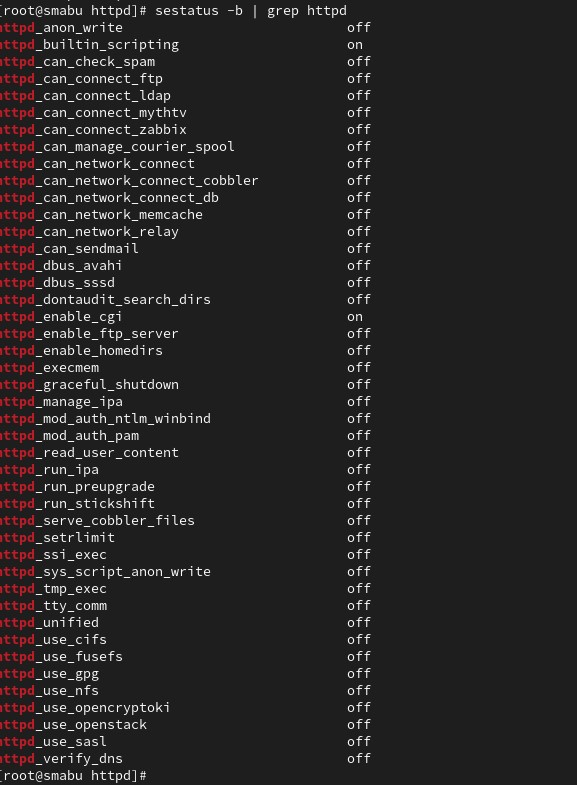{#fig:004 width=70%}

Посмотрите статистику по политике с помощью команды seinfo, также определите множество пользователей, ролей, типов (рис. [-@fig:005]):

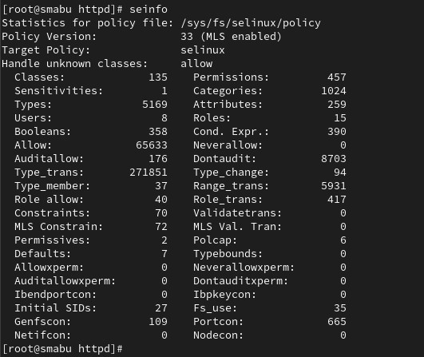{#fig:005 width=70%}

Определите тип файлов и поддиректорий, находящихся в директории
/var/www, с помощью команды ls -lZ /var/www (рис. [-@fig:006]):

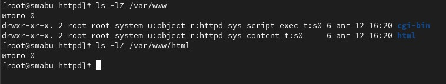{#fig:006 width=70%}

ОСоздайте от имени суперпользователя (так как в дистрибутиве после установки только ему разрешена запись в директорию) html-файл
/var/www/html/test.html следующего содержания (рис. [-@fig:007]):

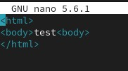{#fig:007 width=70%}

Проверьте контекст созданного вами файла. Занесите в отчёт контекст,
присваиваемый по умолчанию вновь созданным файлам в директории
/var/www/html. Обратитесь к файлу через веб-сервер, введя в браузере адрес
http://127.0.0.1/test.html. Убедитесь, что файл был успешно отображё (рис. [-@fig:008]):

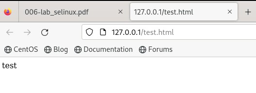{#fig:008 width=70%}

Изучите справку man httpd_selinux и выясните, какие контексты файлов определены для httpd. Сопоставьте их с типом файла
test.html. Проверить контекст файла можно командой ls -Z.
ls -Z /var/www/html/test.htm (рис. [-@fig:009]):

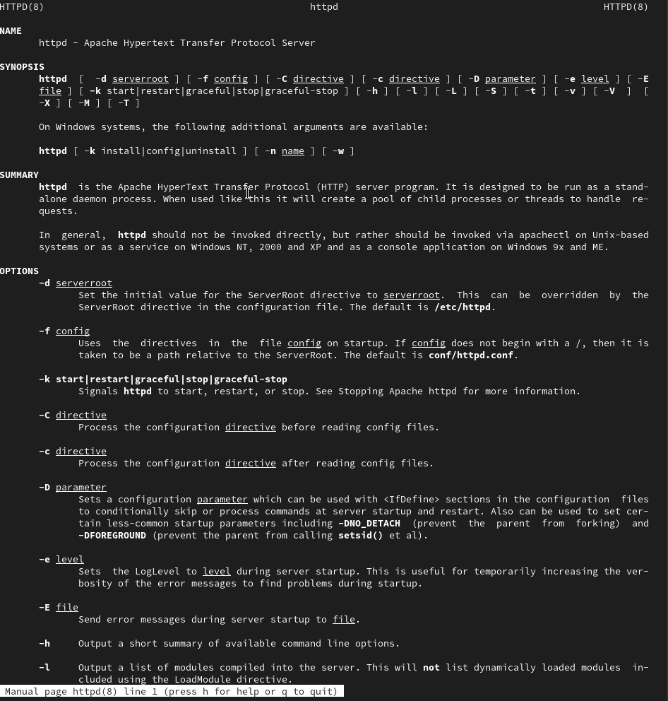{#fig:009 width=70%}

Измените контекст файла /var/www/html/test.html с httpd_sys_content_t на любой другой, к которому процесс httpd не должен иметь доступа, например, на samba_share_t (рис. [-@fig:010]):

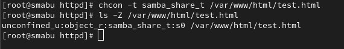{#fig:010 width=70%}

После этого проверьте, что контекст поменялся. Попробуйте ещё раз получить доступ к файлу через веб-сервер, введя в
браузере адрес http://127.0.0.1/test.html. Вы должны получить
сообщение об ошибке:
Forbidden
You don't have permission to access /test.html on this server. (рис. [-@fig:011]):

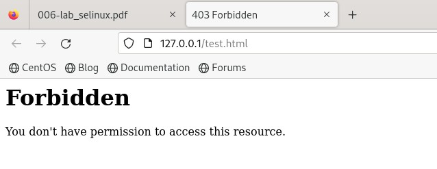{#fig:011 width=70%}

Проанализируйте ситуацию. Почему файл не был отображён, если права
доступа позволяют читать этот файл любому пользователю?
ls -l /var/www/html/test.html
Просмотрите log-файлы веб-сервера Apache. Также просмотрите системный лог-файл:
tail /var/log/messages
Если в системе окажутся запущенными процессы setroubleshootd и
audtd, то вы также сможете увидеть ошибки, аналогичные указанным
выше, в файле /var/log/audit/audit.log. Проверьте это утверждение самостоятельно (рис. [-@fig:012]):

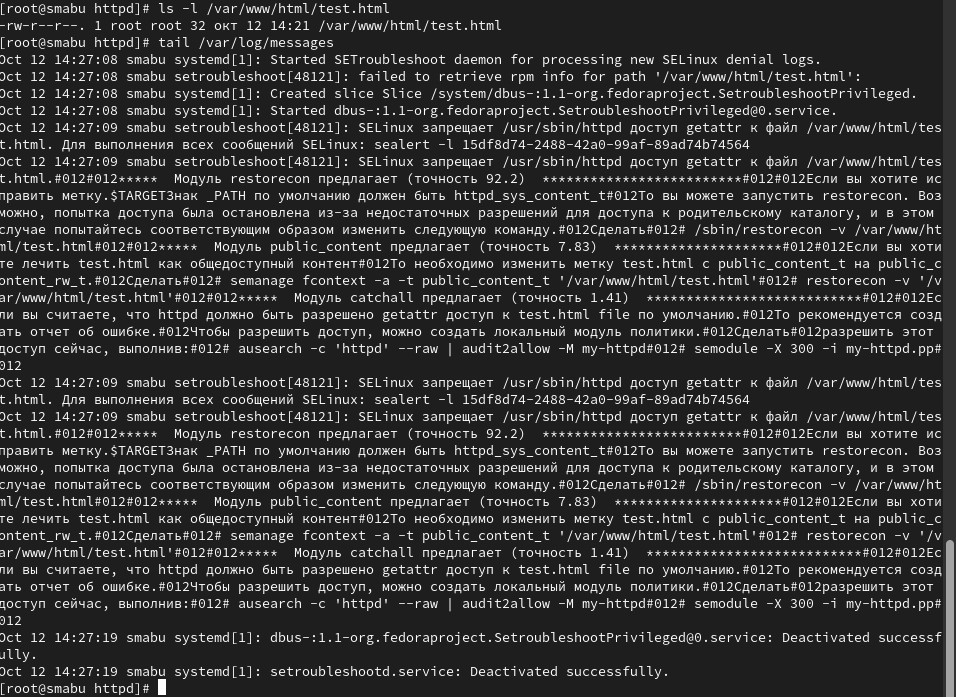{#fig:012 width=70%}

Попробуйте запустить веб-сервер Apache на прослушивание ТСР-порта
81 (а не 80, как рекомендует IANA и прописано в /etc/services). Для
этого в файле /etc/httpd/httpd.conf найдите строчку Listen 80 и замените её на Listen 81. лог-файлы:
tail -nl /var/log/messages
Просмотрите файлы /var/log/http/error_log,
/var/log/http/access_log и /var/log/audit/audit.log (рис. [-@fig:013]):

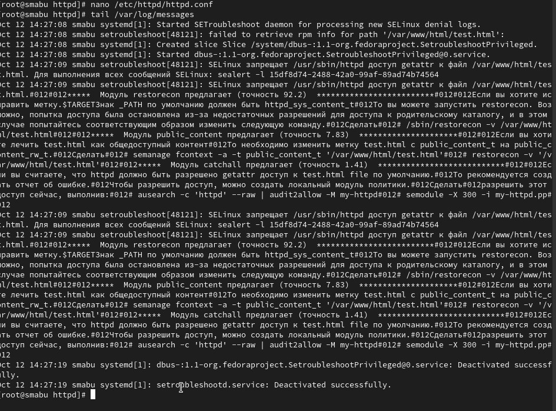{#fig:013 width=70%}

Выполните команду
semanage port -a -t http_port_t -р tcp 81
После этого проверьте список портов командой
semanage port -l | grep http_port_t
Убедитесь, что порт 81 появился в списке (рис. [-@fig:014]):

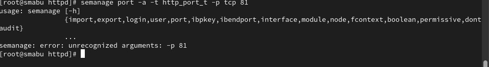{#fig:014 width=70%}

Верните контекст httpd_sys_cоntent__t к файлу /var/www/html/ test.html:
chcon -t httpd_sys_content_t /var/www/html/test.html
После этого попробуйте получить доступ к файлу через веб-сервер, введя в браузере адрес http://127.0.0.1:81/test.html. Исправьте обратно конфигурационный файл apache, вернув Listen 80.
Удалите привязку http_port_t к 81 порту:
semanage port -d -t http_port_t -p tcp 81
и проверьте, что порт 81 удалён.
Удалите файл /var/www/html/test.html:
rm /var/www/html/test.html (рис. [-@fig:015]):

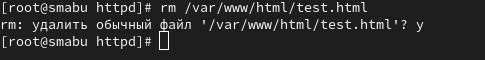{#fig:015 width=70%}

# Выводы

Развивли свои навыки администрирования ОС Linux. Получить первое практическое знакомство с технологией SELinux1. Проверили работу SELinx на практике совместно с веб-сервером
Apache.

# Список литературы{.unnumbered}

::: {#refs}
:::
