---
## Front matter
lang: ru-RU
title: Установка Kali Linux
subtitle: Этап 1
author:
  - Абу Сувейлим М. М.
institute:
  - Российский университет дружбы народов, Москва, Россия
date: 10 января 2003

## i18n babel
babel-lang: russian
babel-otherlangs: english

## Formatting pdf
toc: false
toc-title: Содержание
slide_level: 2
aspectratio: 169
section-titles: true
theme: metropolis
header-includes:
 - \metroset{progressbar=frametitle,sectionpage=progressbar,numbering=fraction}
---

# Информация

## Докладчик

:::::::::::::: {.columns align=center}
::: {.column width="70%"}

  * Абу Сувейлим Мухаммед Мунифович
  * Студент
  * Российский университет дружбы народов
  * [1032215135@pfur.ru](mailto:1032215135@pfur.ru)
  * <https://mukhammed-abu-suveilim.github.io/>

:::
::::::::::::::

# Вводная часть

## Цели и задачи

- Загрузить дистрибутив Kali Linux 64-bit.
- Установить Kali Linux в виртуальную машину.

## Материалы и методы

- Парасрам Шива Х.Т. Замм Алекс. Kali Linux. Тестирование на проникновение и безопасность. СПб, 2020. 448 с.
- Толчёнова М. Kali Linux: обзор дистрибутива для будущих хакеров. 2024.

# Выполнение лабораторной работы

## Загрузка

Kali Linux: <https://www.kali.org/get-kali/#kali-installer-images>. 
В качетве образа выбрал Installer 64-bit (рис. [-@fig:001]).

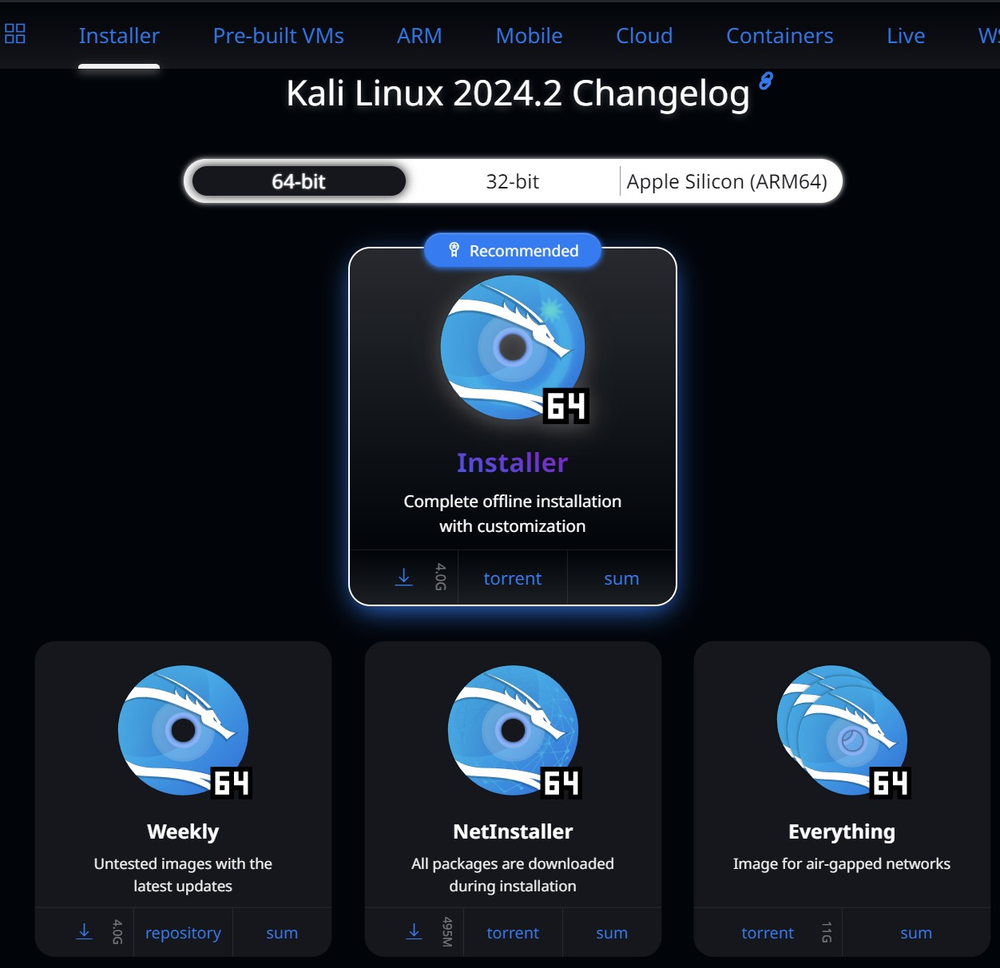{#fig:001 width=50%}

## Установка 1

1. Создать новую виртуальную машину, нажав на панели инструментов кнопку
New (Создать) (рис. [-@fig:002]).

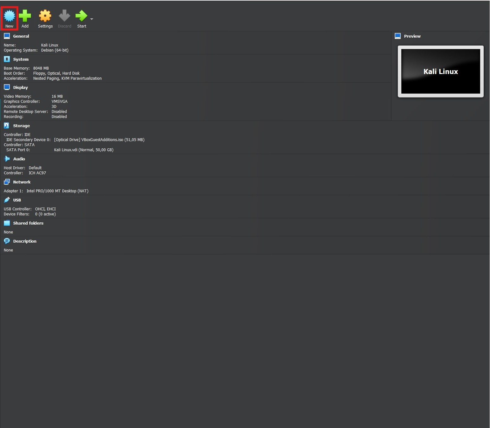{#fig:002 width=40%}

## Установка 2

2. Далее следует ввести имя создаваемой виртуальной машины, а также выбрать
тип и версию операционной системы. Я назвал создаваемую 
виртуальную машину Kali Linux, выбрал из раскрывающегося списка Type (Тип)
вариант Linux, а из списка Version (Версия) — версию Debian (64-bit). После определения типа и версии системы нажмите кнопку Next (Далее) (рис. [-@fig:003]).

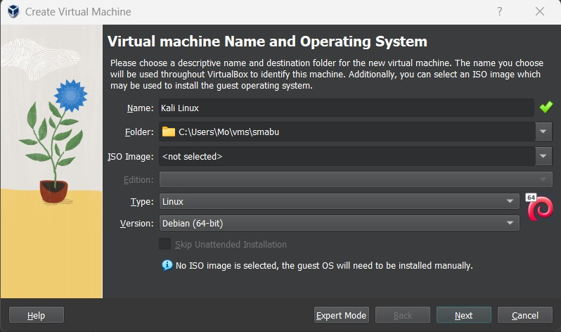{#fig:003 width=50%}

## Установка 3

3. Следующим шагом мы определяем объем оперативной памяти 8 ГБ, выделяемой для 
виртуальной машины (рис. [-@fig:004]) и жесткого диска 50 ГБ (рис. [-@fig:005]). Next (Далее).

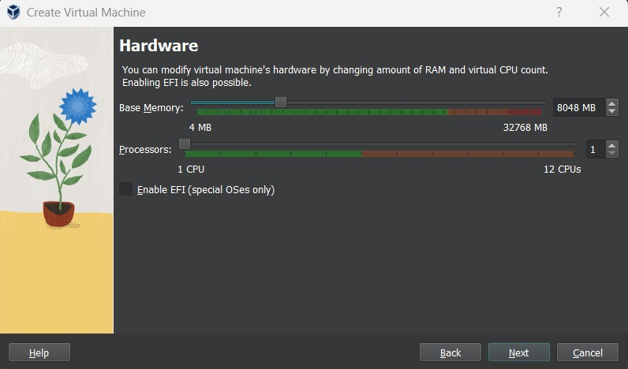{#fig:004 width=50%}

## Установка 4

{#fig:005 width=50%}

## Установка 5

4. Подключение образа оптического диска (рис. [-@fig:006])

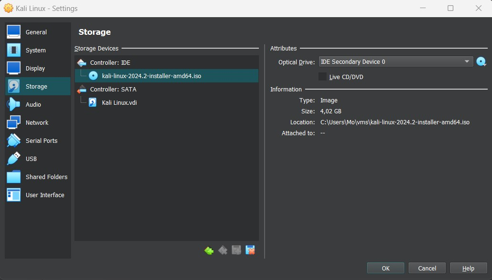{#fig:006 width=50%}

## Установка 6 

5. Запустил виртуальную машину и перешел к настройкам установки операционной системы (рис. [-@fig:007]).

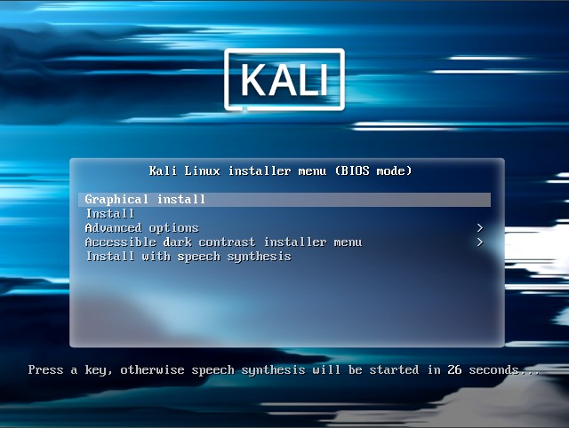{#fig:007 width=50%}

## Установка 7

6. После выбора варианта Graphical install (Графическая установка) на экране появится первое кно установки операционной системы. В процессе установки потребуется настроить следующие параметры.

## Установка 8

Set Language (Выбор языка). Я выбрал английский язык (рис. [-@fig:008]).

{#fig:008 width=50%}

## Установка 9

Selection Location (Выбор места расположения). Выбрал Russian Federation из раскрывающегося списка (рис. [-@fig:009]).

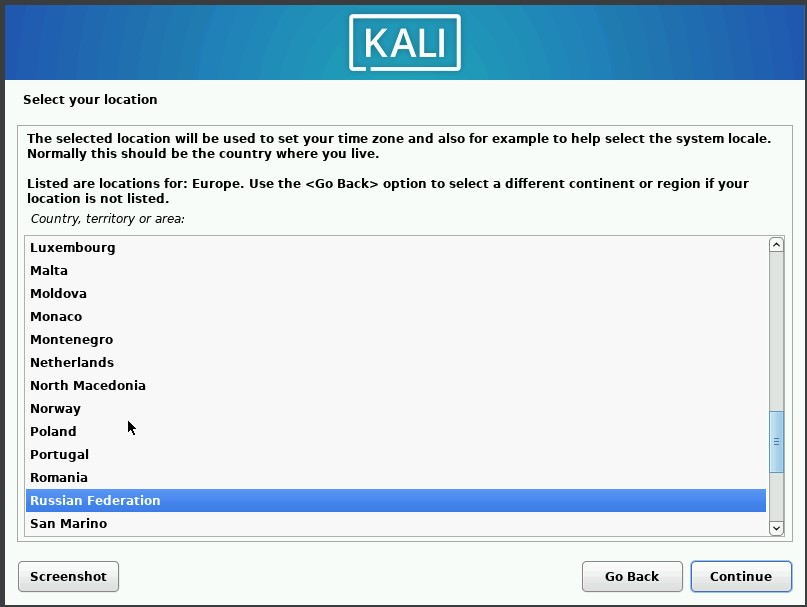{#fig:009 width=50%}

## Установка 10

Configure the Keyboard (Конфигурация клавиатуры). Выбрал en_US.UTF-8 (рис. [-@fig:010]).

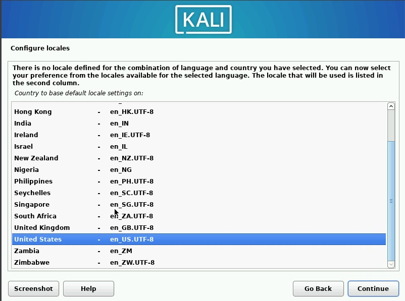{#fig:010 width=50%}

## Установка 11

Host Name for the system (Имя хоста для системы).Имя хоста - smabu (рис. [-@fig:011]).

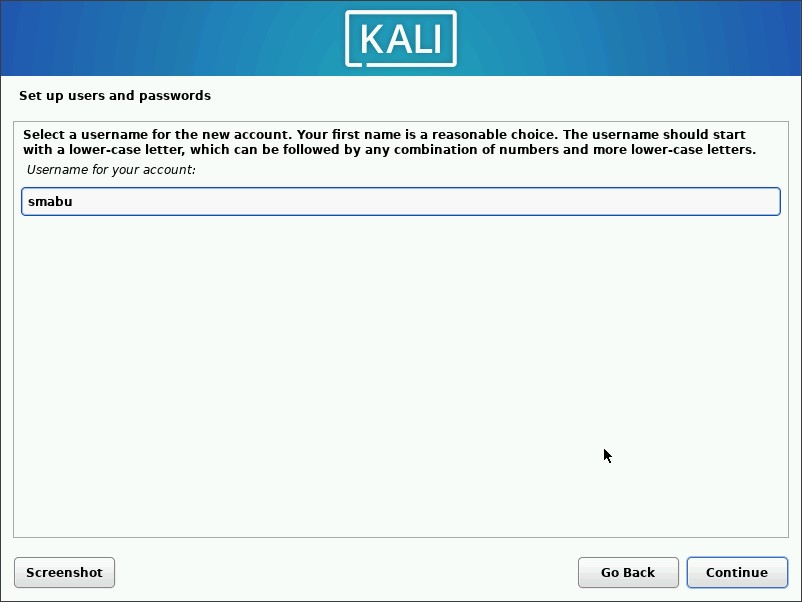{#fig:011 width=50%}

## Установка 12

Partition Disk (Раздел диска).Программа установки поможет разбить диск
на разделы. Здесь я ничего не менял кроме одного выбора - это записать изменения на 
диск. По умолчанию, переключатель Write the changes to disks? (Записать изменения на
диск?) установлен в положение No (Нет), а надо Yes (Да) (рис. [-@fig:012], [-@fig:013], [-@fig:014], [-@fig:015],).

## Установка 13

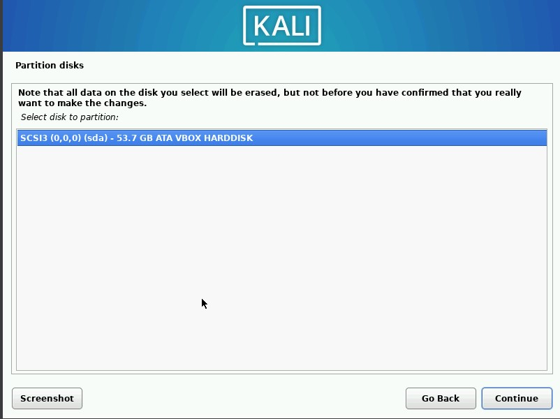{#fig:012 width=50%}

## Установка 14

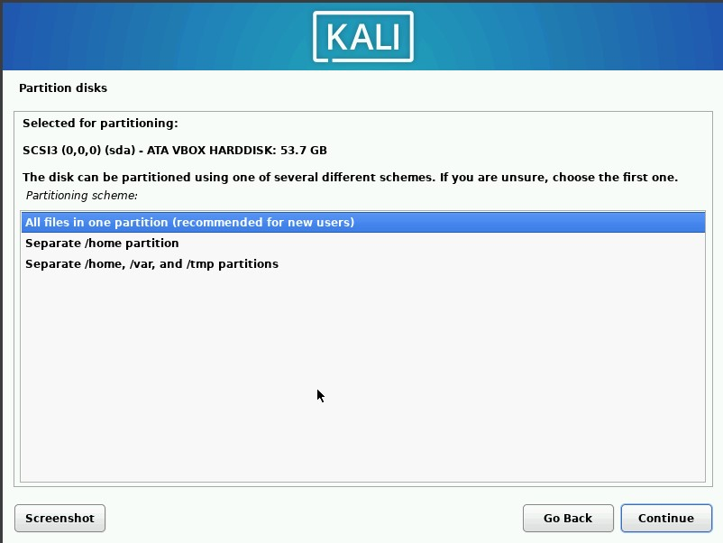{#fig:013 width=50%}

## Установка 15

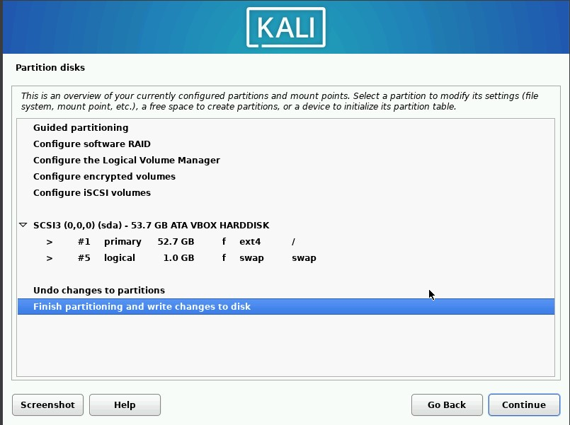{#fig:014 width=50%}

## Установка 16

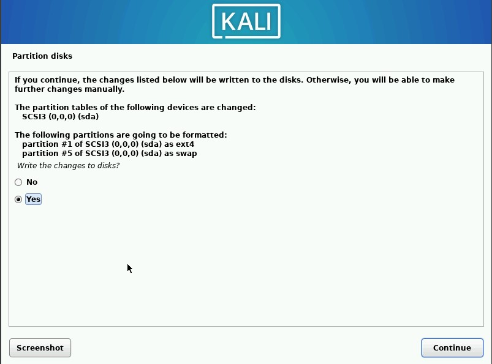{#fig:015 width=50%}

## Установка 17

Осталось выбрать окружения рабочего стола. Я выбрал GNOME при второй установки ОС (рис. [-@fig:016]). Установщик предложит по умолчанию установить загрузчик GRUB в главную
загрузочную запись (MBR). Так как, на моем компьютере Kali.Linux устанавливается как единственная операционная система, я выбрал да (рис. [-@fig:017]).

## Установка 18

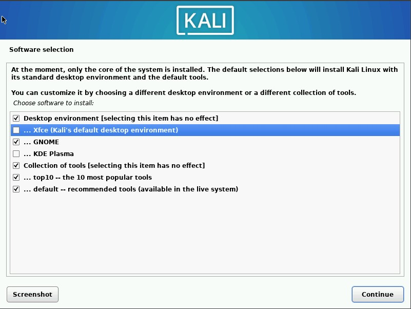{#fig:016 width=50%}

## Установка 19

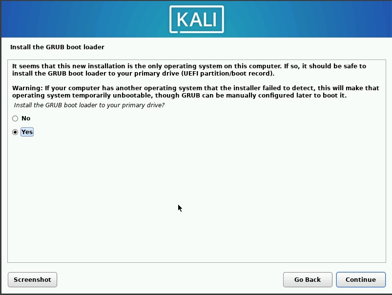{#fig:017 width=50%}

## Установка 20

7. Kali Linux успешно установлен на вирулаьной машине (рис. [-@fig:018]).

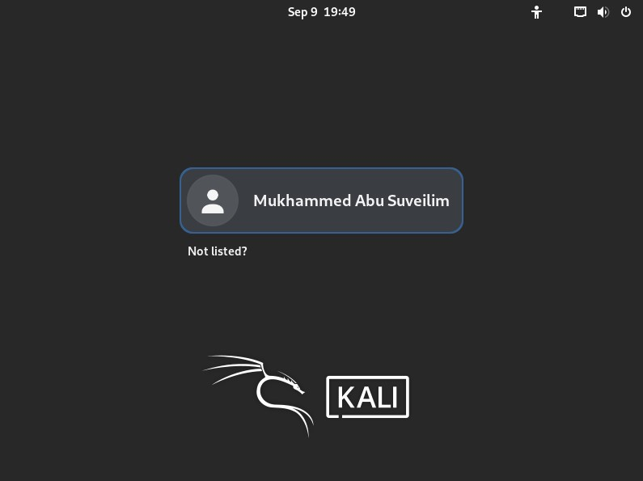{#fig:018 width=50%}

## Установка 21

8. Далее, я сделал обновление системы (рис. [-@fig:019]) и устонвил пакет linux-headers (рис. [-@fig:020])

## Установка 21

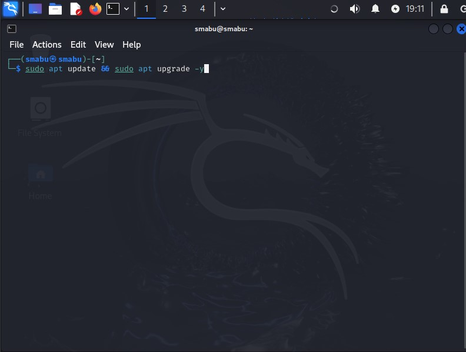{#fig:019 width=50%}

## Установка 22

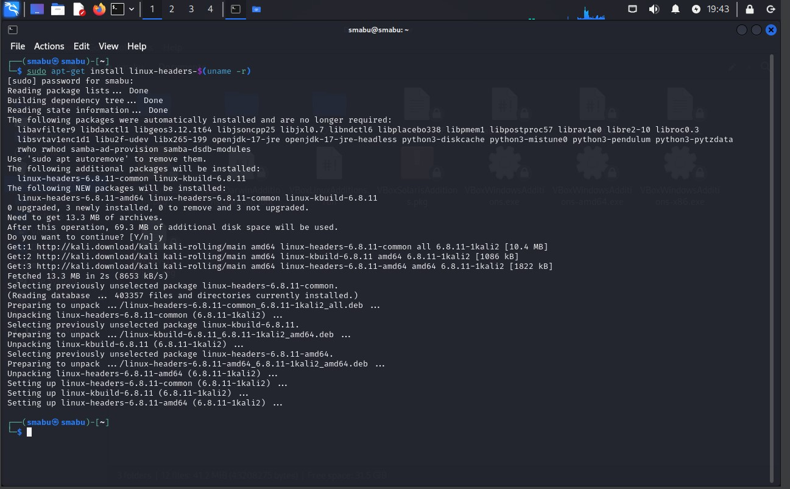{#fig:020 width=50%}

## Проблемы при установки дистрибутива Kali Linux

Не удалось устоновить гостевые дополнения VirtualBox (рис. [-@fig:021])

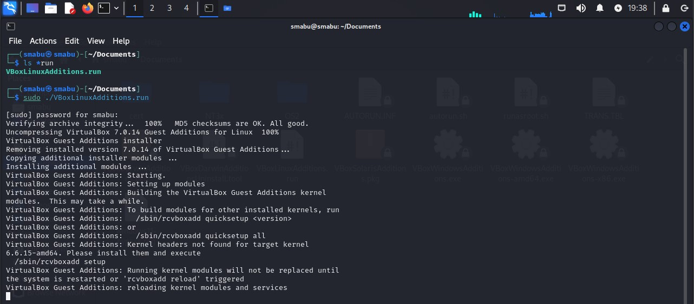{#fig:021 width=50%}

# Выводы

Успешно смогли установить дистрибутив Kali Linux в виртуальную машину.