---
## Front matter
title: "Установка Kali Linux"
subtitle: "Этап 1"
author: "Абу Сувейлим Мухаммед Мунифович"

## Generic otions
lang: ru-RU
toc-title: "Содержание"

## Bibliography
bibliography: bib/cite.bib
csl: pandoc/csl/gost-r-7-0-5-2008-numeric.csl

## Pdf output format
toc: true # Table of contents
toc-depth: 2
lof: true # List of figures
lot: true # List of tables
fontsize: 12pt
linestretch: 1.5
papersize: a4
documentclass: scrreprt
## I18n polyglossia
polyglossia-lang:
  name: russian
  options:
	- spelling=modern
	- babelshorthands=true
polyglossia-otherlangs:
  name: english
## I18n babel
babel-lang: russian
babel-otherlangs: english
## Fonts
mainfont: IBM Plex Serif
romanfont: IBM Plex Serif
sansfont: IBM Plex Sans
monofont: IBM Plex Mono
mathfont: STIX Two Math
mainfontoptions: Ligatures=Common,Ligatures=TeX,Scale=0.94
romanfontoptions: Ligatures=Common,Ligatures=TeX,Scale=0.94
sansfontoptions: Ligatures=Common,Ligatures=TeX,Scale=MatchLowercase,Scale=0.94
monofontoptions: Scale=MatchLowercase,Scale=0.94,FakeStretch=0.9
mathfontoptions:
## Biblatex
biblatex: true
biblio-style: "gost-numeric"
biblatexoptions:
  - parentracker=true
  - backend=biber
  - hyperref=auto
  - language=auto
  - autolang=other*
  - citestyle=gost-numeric
## Pandoc-crossref LaTeX customization
figureTitle: "Рис."
tableTitle: "Таблица"
listingTitle: "Листинг"
lofTitle: "Список иллюстраций"
lotTitle: "Список таблиц"
lolTitle: "Листинги"
## Misc options
indent: true
header-includes:
  - \usepackage{indentfirst}
  - \usepackage{float} # keep figures where there are in the text
  - \floatplacement{figure}{H} # keep figures where there are in the text
---

# Цель работы

Научиться как загрузить и установить Kali Linux на виртуальной машине [@KaliLinux].

# Задание

Установить дистрибутив Kali Linux в виртуальную машину VirtualBox. 

# Теоретическое введение

Kali Linux — это дистрибутив операционной системы Linux, предназначенный для специалистов по информационной безопасности. Он позволяет выполнять расширенное тестирование на проникновение, находить системные уязвимости и устранять возможные лазейки для взломщиков [@skillbox.ru]. 

# Выполнение лабораторной работы

Перед установкой и использованием Kali Linux нужно загрузить ее образ. Я загрузил образ с сайта Kali Linux (<https://www.kali.org/get-kali/#kali-installer-images>). В качетве образа выбрал Installer 64-bit (рис. [-@fig:001])

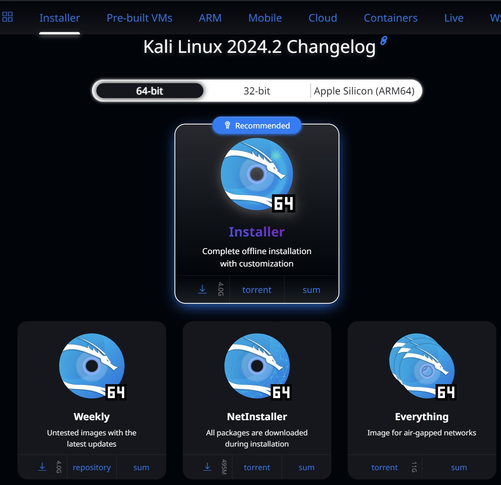{#fig:001 width=70%}

Для установки Kali Linux на виртуальную машину с ISO-образа нужно выполнить следующие действия:

1. Создать новую виртуальную машину, нажав на панели инструментов кнопку
New (Создать) (рис. [-@fig:002]).

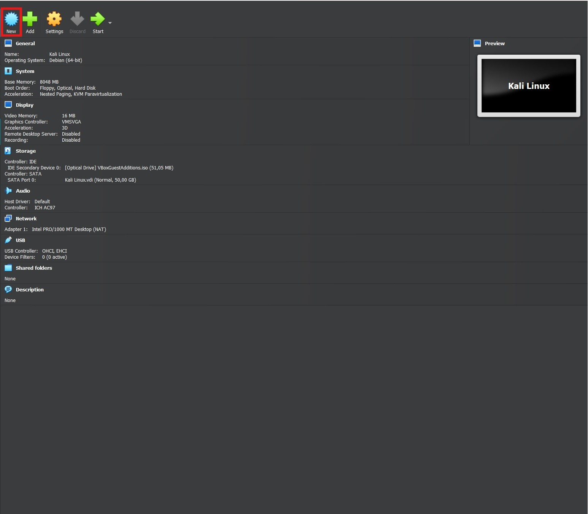{#fig:002 width=70%}

2. Далее следует ввести имя создаваемой виртуальной машины, а также выбрать
тип и версию операционной системы. Я назвал создаваемую 
виртуальную машину Kali Linux, выбрал из раскрывающегося списка Type (Тип)
вариант Linux, а из списка Version (Версия) — версию Debian (64-bit). После определения типа и версии системы нажмите кнопку Next (Далее) (рис. [-@fig:003]).

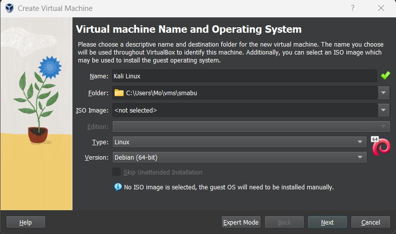{#fig:003 width=70%}

3. Следующим шагом мы определяем объем оперативной памяти 8 ГБ, выделяемой для 
виртуальной машины (рис. [-@fig:004]) и жесткого диска 50 ГБ (рис. [-@fig:005]). Next (Далее).

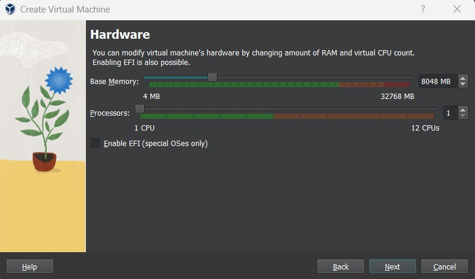{#fig:004 width=70%}

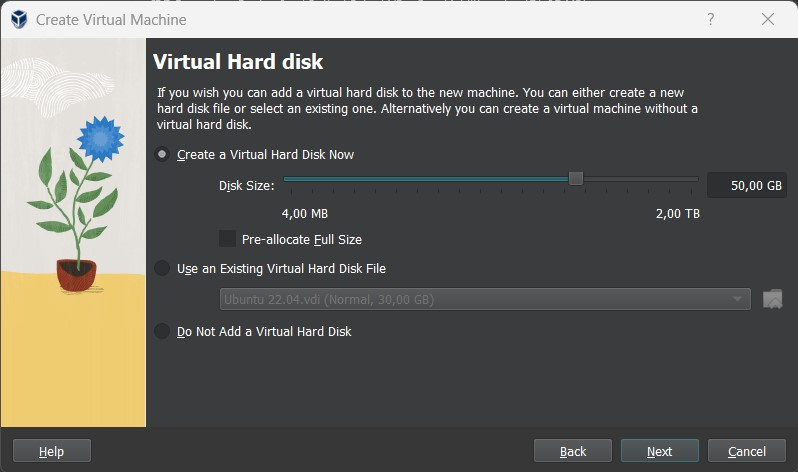{#fig:005 width=70%}

4. Подключение образа оптического диска (рис. [-@fig:006])

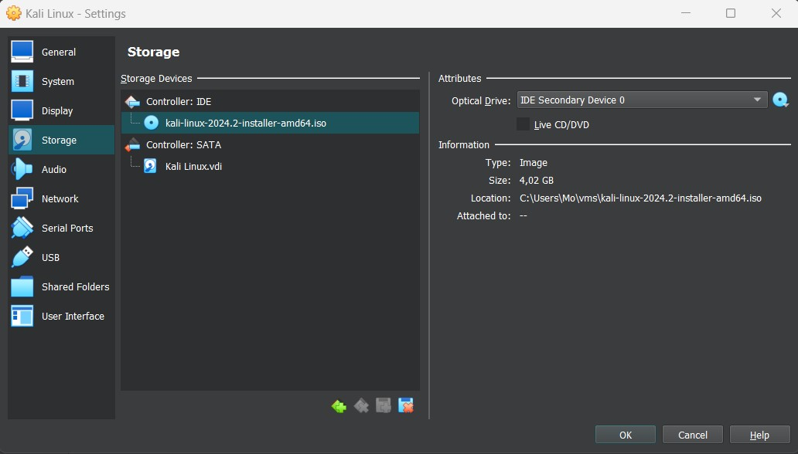{#fig:006 width=70%}

5. Запустил виртуальную машину и перешел к настройкам установки операционной системы (рис. [-@fig:007]).

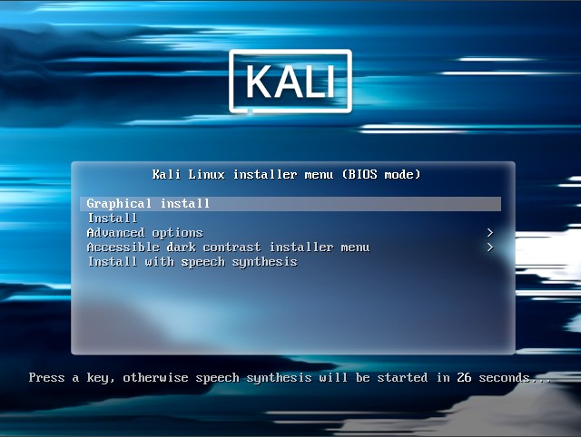{#fig:007 width=70%}

6. После выбора варианта Graphical install (Графическая.установка) на экране появится первое кно установки операционной системы. В процессе установки потребуется настроить следующие параметры.

Set Language (Выбор языка). Я выбрал английский язык (рис. [-@fig:008]).

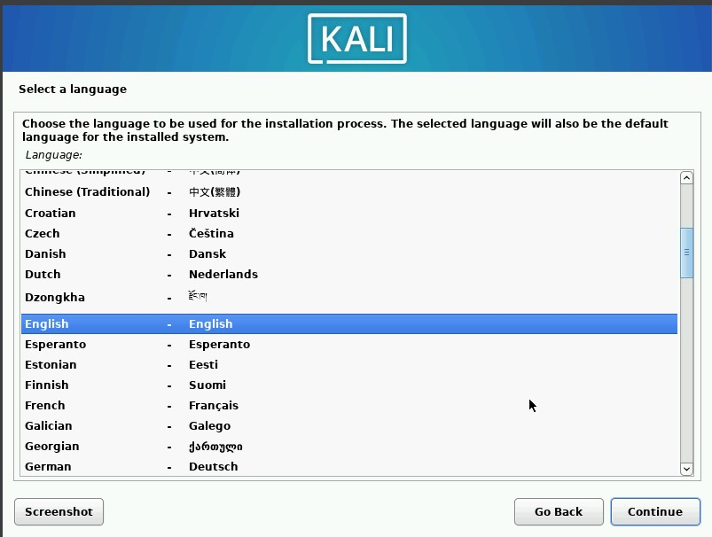{#fig:008 width=70%}

Selection Location (Выбор места расположения). Выбрал Russian Federation из раскрывающегося списка (рис. [-@fig:009]).

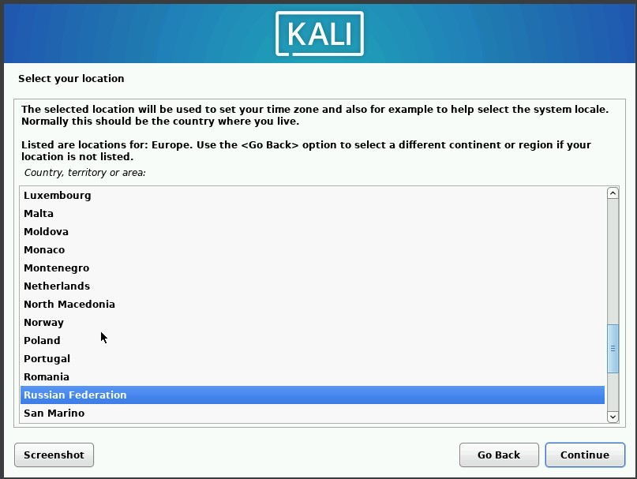{#fig:009 width=70%}

Configure the Keyboard (Конфигурация клавиатуры). Выбрал en_US.UTF-8 (рис. [-@fig:010]).

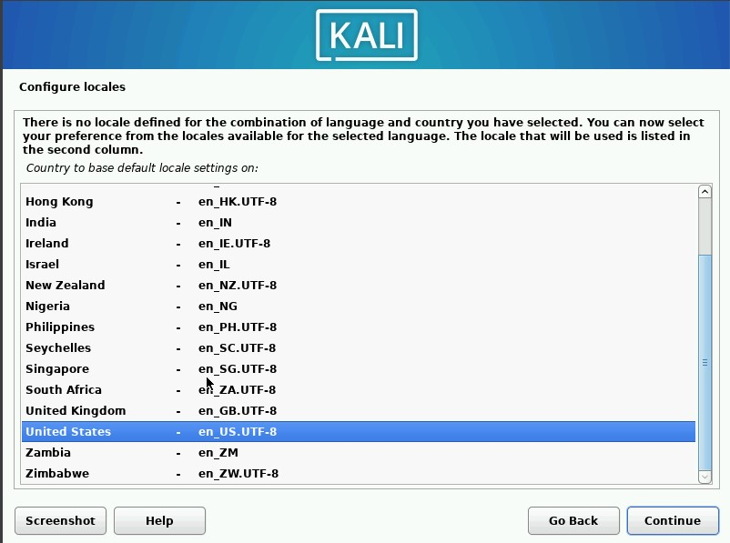{#fig:010 width=70%}

Host Name for the system (Имя хоста для системы).Имя хоста - smabu (рис. [-@fig:011]).

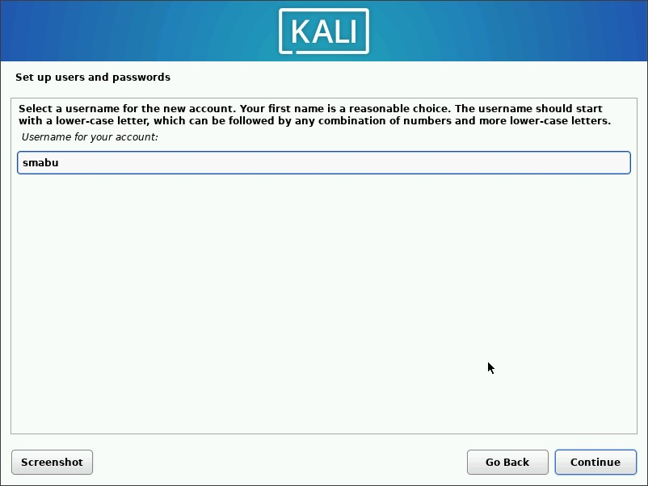{#fig:011 width=70%}

Partition Disk (Раздел диска).Программа установки поможет разбить диск
на разделы. Здесь я ничего не менял кроме одного выбора - это записать изменения на 
диск. По умолчанию, переключатель Write the changes to disks? (Записать изменения на
диск?) установлен в положение No (Нет), а надо Yes (Да) (рис. [-@fig:012], [-@fig:013], [-@fig:014], [-@fig:015],).

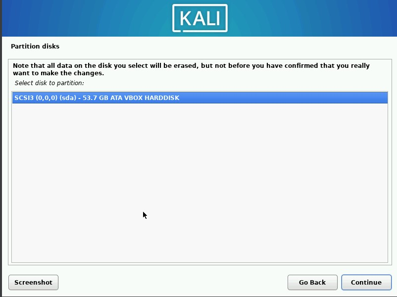{#fig:012 width=50%}

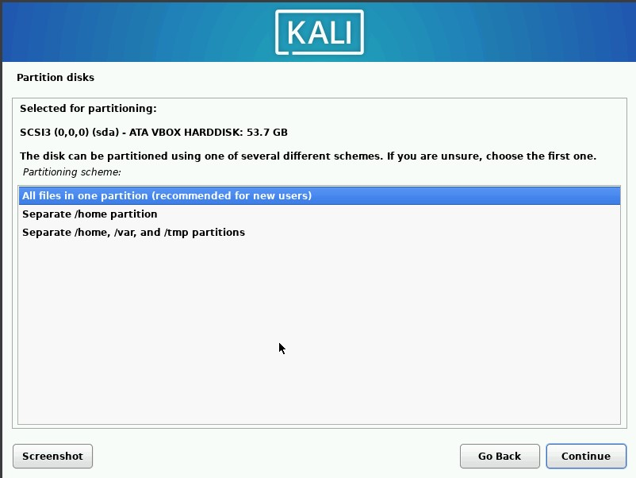{#fig:013 width=50%}

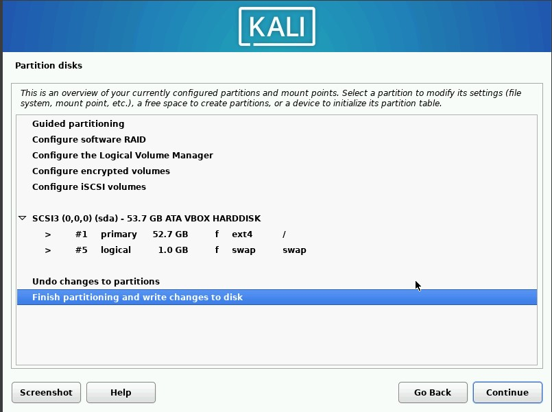{#fig:014 width=50%}

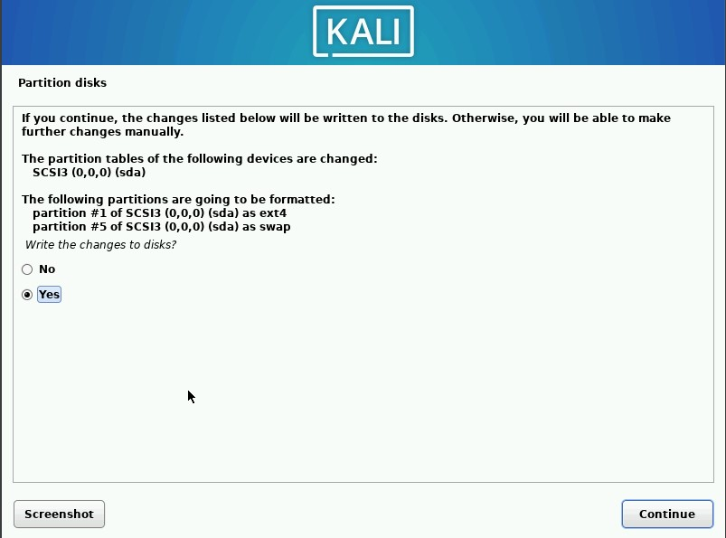{#fig:015 width=50%}

Осталось выбрать окружения рабочего стола. Я выбрал GNOME при второй установки ОС (рис. [-@fig:016]). Установщик предложит по умолчанию установить загрузчик GRUB в главную
загрузочную запись (MBR). Так как, на моем компьютере Kali.Linux устанавливается как единственная операционная система, я выбрал да (рис. [-@fig:017]).

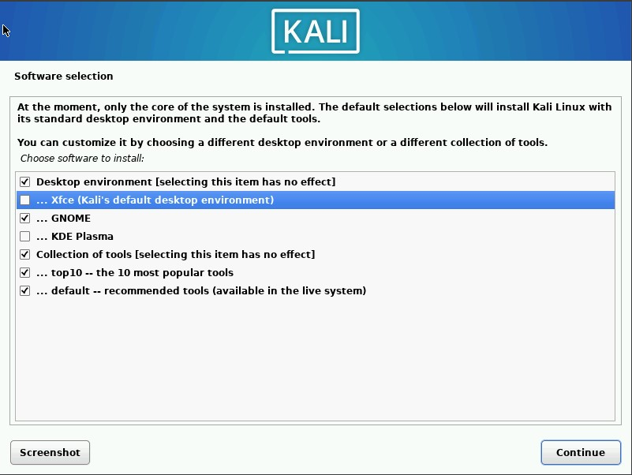{#fig:016 width=70%}

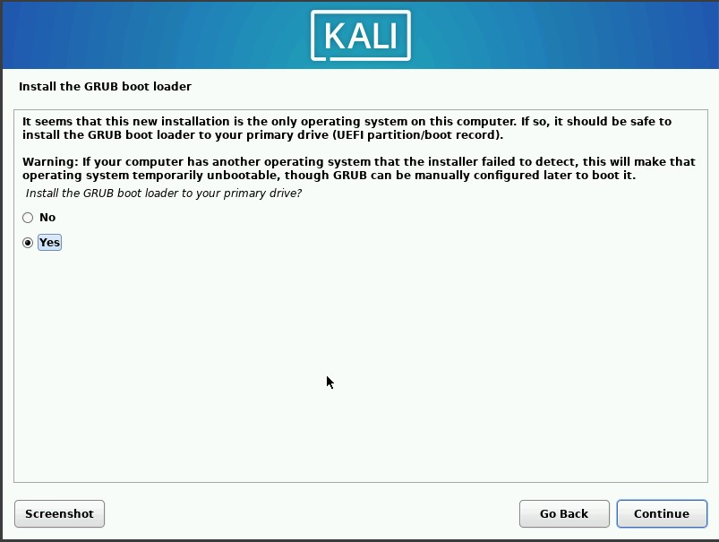{#fig:017 width=70%}

7. Kali Linux успешно установлен на вирулаьной машине (рис. [-@fig:018]).

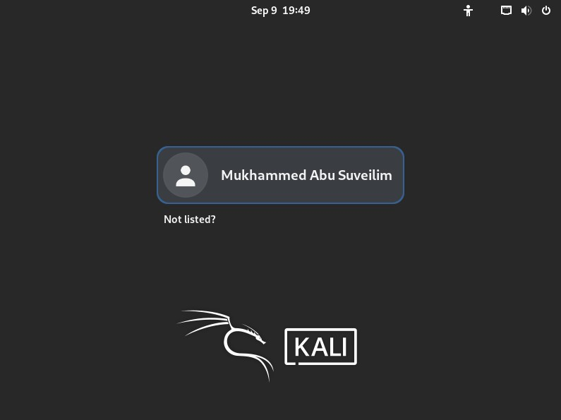{#fig:018 width=70%}

8. Далее, я сделал обновление системы (рис. [-@fig:019]) и устонвил пакет linux-headers (рис. [-@fig:020])

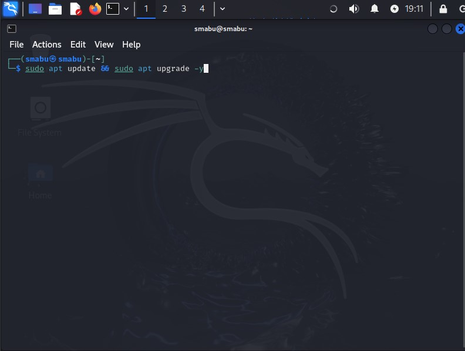{#fig:019 width=70%}

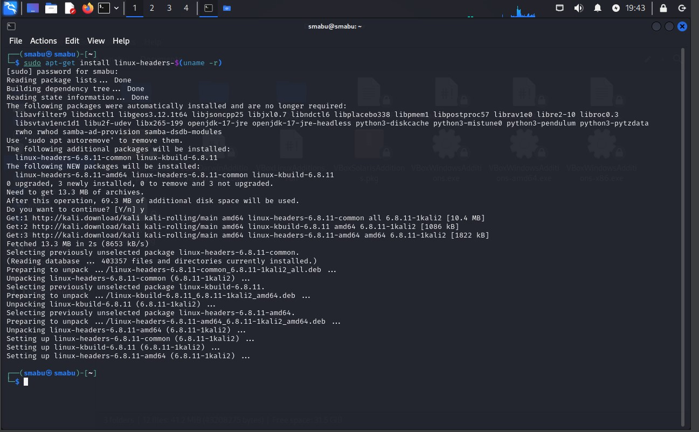{#fig:020 width=70%}

# Выводы

Успешно смогли установить дистрибутив Kali Linux в виртуальную машину.

# Список литературы{.unnumbered}

::: {#refs}
:::
