---
## Front matter
lang: ru-RU
title: Установка DVWA
subtitle: Этап 2
author:
  - Абу Сувейлим М. М.
institute:
  - Российский университет дружбы народов, Москва, Россия
date: 10 января 2003

## i18n babel
babel-lang: russian
babel-otherlangs: english

## Formatting pdf
toc: false
toc-title: Содержание
slide_level: 2
aspectratio: 169
section-titles: true
theme: metropolis
header-includes:
 - \metroset{progressbar=frametitle,sectionpage=progressbar,numbering=fraction}
---

# Информация

## Докладчик

:::::::::::::: {.columns align=center}
::: {.column width="70%"}

  * Абу Сувейлим Мухаммед Мунифович
  * Студент
  * Российский университет дружбы народов
  * [1032215135@pfur.ru](mailto:1032215135@pfur.ru)
  * <https://mukhammed-abu-suveilim.github.io/>

:::
::::::::::::::

# Вводная часть

## Цели и задачи

- Научиться как загрузить и установить DVWA на Kali Linux.

## Материалы и методы

1. Парасрам Шива Х.Т. Замм Алекс. Kali Linux. Тестирование на проникновение и безопасность. СПб, 2020. 448 с.
2. cryptoparty. DVWA – Уязвимое веб-приложение. 2018

# Выполнение лабораторной работы

## Git Clone

Для начала скачаем последнюю версию из репозитория командой (рис. [-@fig:001]):

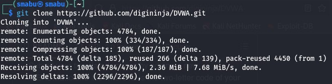{#fig:001 width=50%}
 
## Директория html

Далее переместимся в директорию /var/www/html (рис. [-@fig:002]):

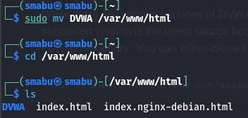{#fig:002 width=50%}

## Unable to connect to localhost

Если попрубовть войти в localhost, получаем ошибку, так как не устнановлен сервер (рис. [-@fig:003]):

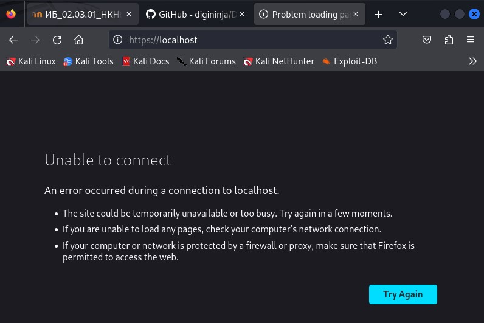{#fig:003 width=50%}

## Сервер apache2

Чтобы решить эту проблему нужно запустить сервер apache2 (рис. [-@fig:004]; [-@fig:005]):

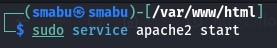{#fig:004 width=40%}

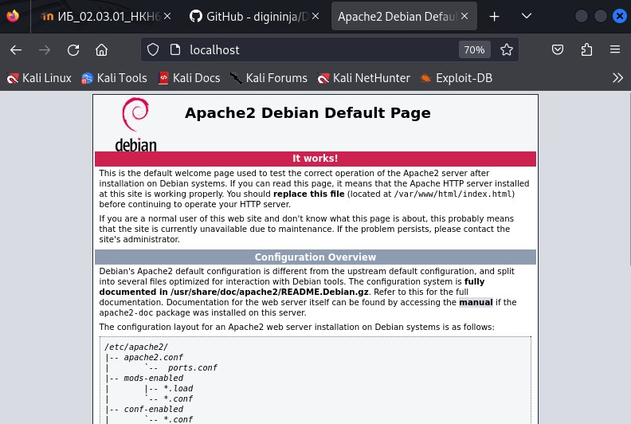{#fig:005 width=40%}

## Ошибка config file not found

Также если попрубовть войти в localhost/DVWA не получиться (рис. [-@fig:006]):

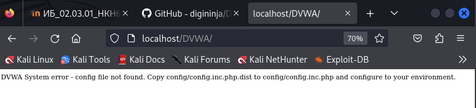{#fig:006 width=50%}

## Директория DVWA

Аналогичено, чтобы решить эту проблему мы переместимся в директорию DVMA (рис. [-@fig:007])

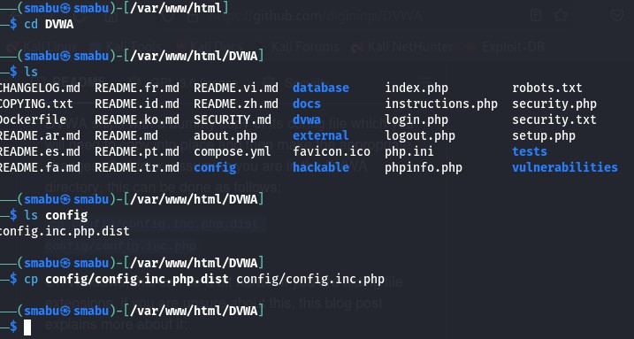{#fig:007 width=50%}

## Файл Config

DVWA поставляется с фиктивной копией своего конфигурационного (config) файла, который нам нужно будет скопировать в директорие, а затем внести соответствующие изменения. В Linux это можно сделать как показно на  (рис. [-@fig:007]).

## Cтраница нвстройки

Теперь можно открыть страницу нвстройки localhost/DVWA/setup.php (рис. [-@fig:008]):

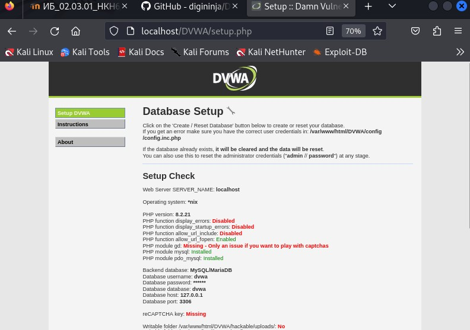{#fig:008 width=50%}

## Настройка базы данных

Осталось настроить базу данных (рис. [-@fig:009]):

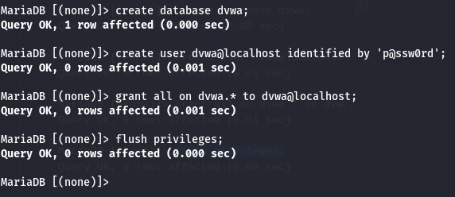{#fig:009 width=50%}

## База данных dvwa

В качестве проверки, можно войти в базу данных как пользовотель dvwa (рис. [-@fig:010]):

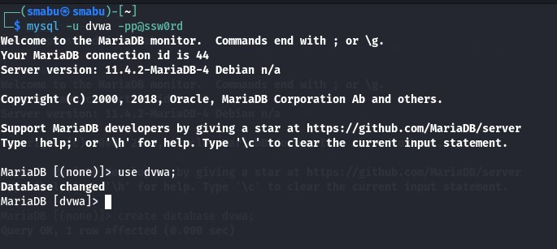{#fig:010 width=50%}

## Все дополнительные опции

Выполнив следующие действия мы может открыть доступ к некоторым функций (рис. [-@fig:011], [-@fig:012]):

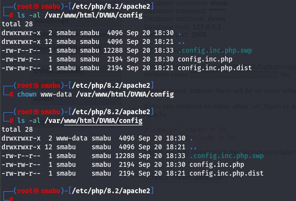{#fig:011 width=50%}

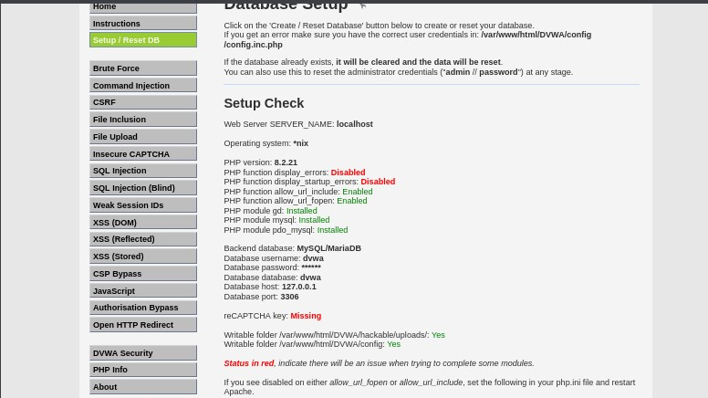{#fig:012 width=50%}

# Выводы

Успешно смогли установить DVWA в гостевую систему к Kali Linux.