---
## Front matter
title: "Установка DVWA"
subtitle: "Этап 2"
author: "Абу Сувейлим Мухаммед Мунифович"

## Generic otions
lang: ru-RU
toc-title: "Содержание"

## Bibliography
bibliography: bib/cite.bib
csl: pandoc/csl/gost-r-7-0-5-2008-numeric.csl

## Pdf output format
toc: true # Table of contents
toc-depth: 2
lof: true # List of figures
lot: true # List of tables
fontsize: 12pt
linestretch: 1.5
papersize: a4
documentclass: scrreprt
## I18n polyglossia
polyglossia-lang:
  name: russian
  options:
	- spelling=modern
	- babelshorthands=true
polyglossia-otherlangs:
  name: english
## I18n babel
babel-lang: russian
babel-otherlangs: english
## Fonts
mainfont: IBM Plex Serif
romanfont: IBM Plex Serif
sansfont: IBM Plex Sans
monofont: IBM Plex Mono
mathfont: STIX Two Math
mainfontoptions: Ligatures=Common,Ligatures=TeX,Scale=0.94
romanfontoptions: Ligatures=Common,Ligatures=TeX,Scale=0.94
sansfontoptions: Ligatures=Common,Ligatures=TeX,Scale=MatchLowercase,Scale=0.94
monofontoptions: Scale=MatchLowercase,Scale=0.94,FakeStretch=0.9
mathfontoptions:
## Biblatex
biblatex: true
biblio-style: "gost-numeric"
biblatexoptions:
  - parentracker=true
  - backend=biber
  - hyperref=auto
  - language=auto
  - autolang=other*
  - citestyle=gost-numeric
## Pandoc-crossref LaTeX customization
figureTitle: "Рис."
tableTitle: "Таблица"
listingTitle: "Листинг"
lofTitle: "Список иллюстраций"
lotTitle: "Список таблиц"
lolTitle: "Листинги"
## Misc options
indent: true
header-includes:
  - \usepackage{indentfirst}
  - \usepackage{float} # keep figures where there are in the text
  - \floatplacement{figure}{H} # keep figures where there are in the text
---

# Цель работы

Научиться как загрузить и установить DVWA на Kali Linux [@KaliLinux].

# Задание

Установить DVWA в гостевую систему к Kali Linux.

# Теоретическое введение

Damn Vulnerable Web Application (DVWA) – это веб-приложение PHP / MySQL, которое чертовски уязвимо.

Его основная цель – помочь специалистам по безопасности проверить свои навыки и инструменты в правовой среде, помочь веб-разработчикам лучше понять процессы обеспечения безопасности веб-приложений и помочь студентам и преподавателям узнать о безопасности веб-приложений в контролируемой среде.  [@cryptoparty]

# Выполнение лабораторной работы

Для начала скачаем последнюю версию из репозитория командой (рис. [-@fig:001]):

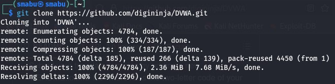{#fig:001 width=70%}
 
Далее переместимся в директорию /var/www/html (рис. [-@fig:002]):

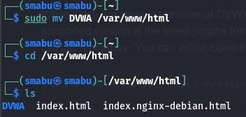{#fig:002 width=70%}

Если попрубовть войти в localhost, получаем ошибку, так как не устнановлен сервер (рис. [-@fig:003]):

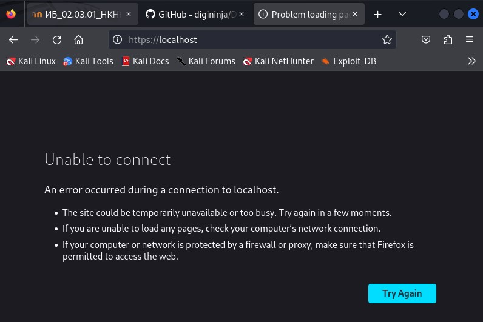{#fig:003 width=70%}

Чтобы решить эту проблему нужно запустить сервер apache2 (рис. [-@fig:004]; [-@fig:005]):

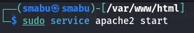{#fig:004 width=70%}

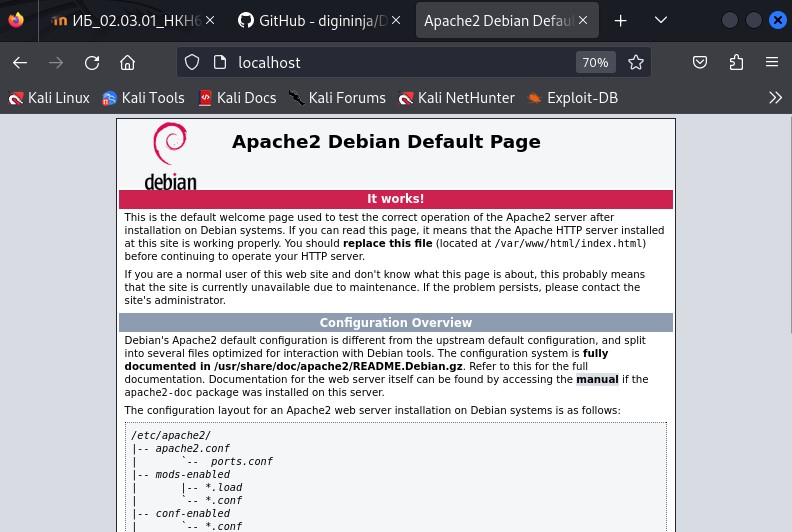{#fig:005 width=70%}

Также если попрубовть войти в localhost/DVWA не получиться (рис. [-@fig:006]):

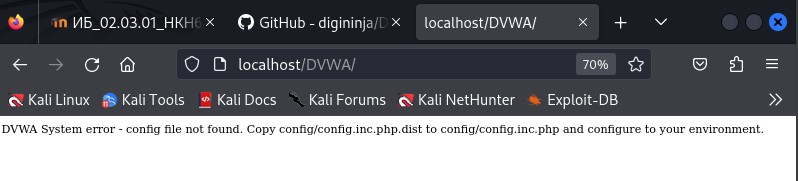{#fig:006 width=70%}

Аналогичено, чтобы решить эту проблему мы переместимся в директорию DVMA (рис. [-@fig:007])

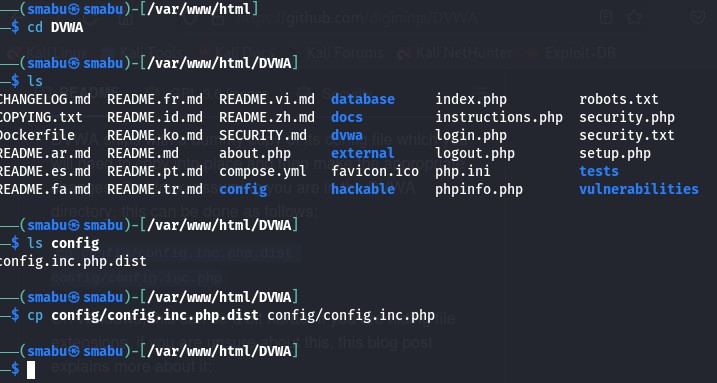{#fig:007 width=70%}

DVWA поставляется с фиктивной копией своего конфигурационного (config) файла, который нам нужно будет скопировать в директорие, а затем внести соответствующие изменения. В Linux это можно сделать как показно на  (рис. [-@fig:007]).

Теперь можно открыть страницу нвстройки localhost/DVWA/setup.php (рис. [-@fig:008]):

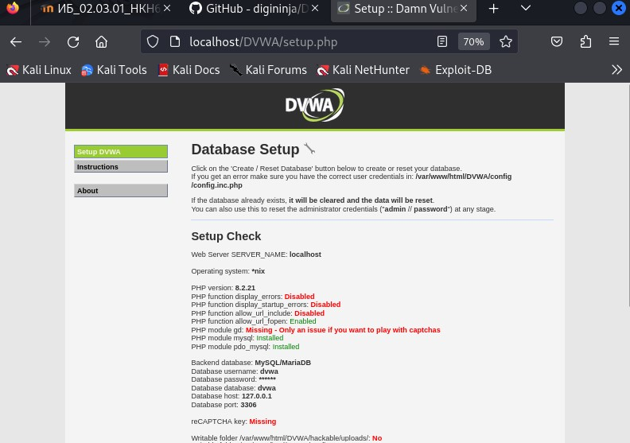{#fig:008 width=70%}

Осталось настроить базу данных (рис. [-@fig:009]):

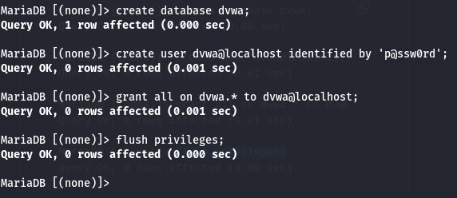{#fig:009 width=70%}

В качестве проверки, можно войти в базу данных как пользовотель dvwa (рис. [-@fig:010]):

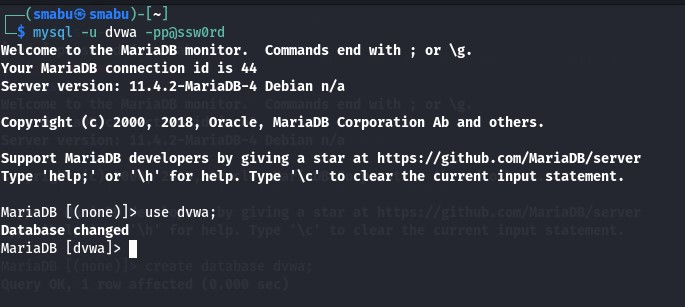{#fig:010 width=70%}

Выполнив следующие действия мы может открыть доступ к некоторым функций (рис. [-@fig:011], [-@fig:012]):

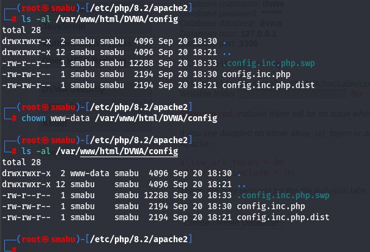{#fig:011 width=70%}

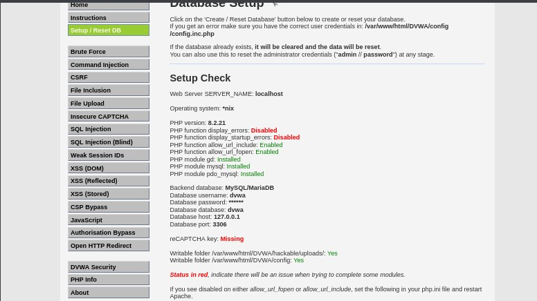{#fig:012 width=70%}

# Выводы

Успешно смогли установить DVWA в гостевую систему к Kali Linux.

# Список литературы{.unnumbered}

::: {#refs}
:::
