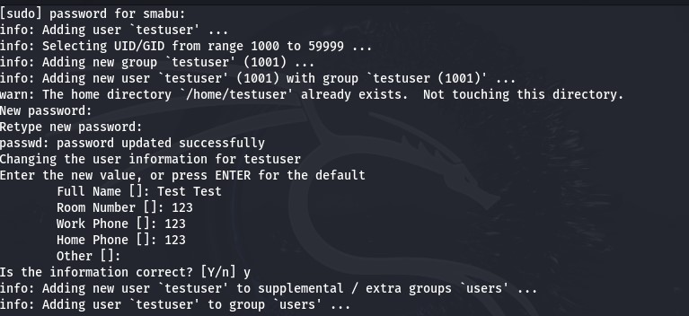
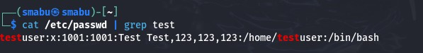
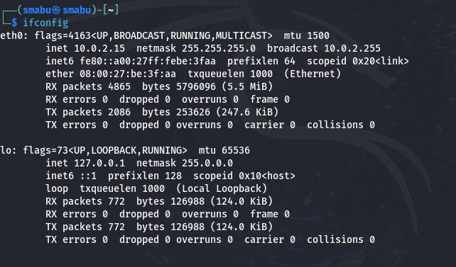
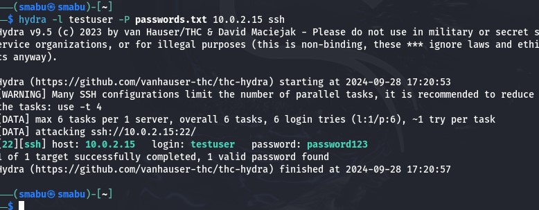

---
## Front matter
lang: ru-RU
title: Использование Hydra
subtitle: Этап 3
author:
  - Абу Сувейлим М. М.
institute:
  - Российский университет дружбы народов, Москва, Россия
date: 10 января 2003

## i18n babel
babel-lang: russian
babel-otherlangs: english

## Formatting pdf
toc: false
toc-title: Содержание
slide_level: 2
aspectratio: 169
section-titles: true
theme: metropolis
header-includes:
 - \metroset{progressbar=frametitle,sectionpage=progressbar,numbering=fraction}
---

# Информация

## Докладчик

:::::::::::::: {.columns align=center}
::: {.column width="70%"}

  * Абу Сувейлим Мухаммед Мунифович
  * Студент
  * Российский университет дружбы народов
  * [1032215135@pfur.ru](mailto:1032215135@pfur.ru)
  * <https://mukhammed-abu-suveilim.github.io/>

:::
::::::::::::::

# Вводная часть

## Цели и задачи

- Выполнить простейшие команды инструмента Hydra
- Взломать пароль по имени пользователя

## Материалы и методы

1. Парасрам Шива Х.Т. Замм Алекс. Kali Linux. Тестирование на проникновение и безопасность. СПб, 2020. 448 с.
2. <https://github.com/vanhauser-thc/thc-hydra>. Hydra – thc-hydra. 2024

# Выполнение лабораторной работы

## Пользователь testuser

Для начала создаим новый пользователь testuser (рис. [-@fig:001]):

{#fig:001 width=70%}

## Команда cat | grep

Проверим данные пользователя (рис. [-@fig:002]):

{#fig:002 width=70%}

## Команда ifconfig

Далее, определим ip адресс машинной (рис. [-@fig:003]):

{#fig:003 width=70%}

## Команда hydra

Наконец то указывается список пользователей и паролей, ip адресс, протокол и выполняем команду (рис. [-@fig:004]):

{#fig:004 width=70%}

Получили логин "testuser" и пароль "password123"

# Выводы

В результате выполнения работы мы повысили свои навыки использования инструмента Hydra.
