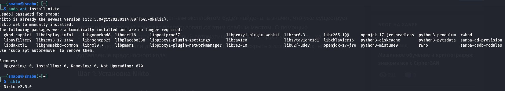
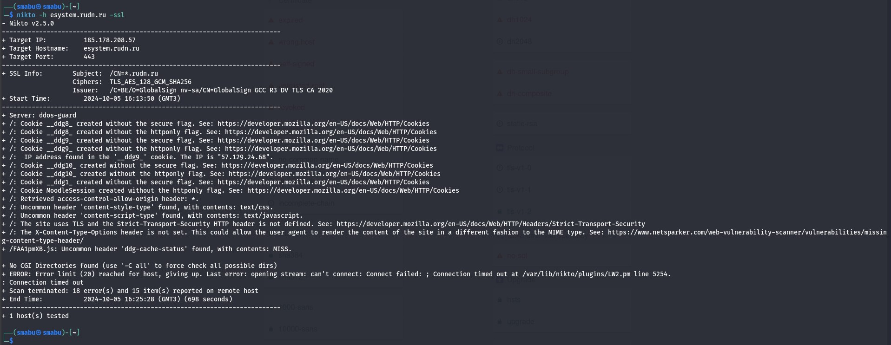

---
## Front matter
lang: ru-RU
title: Использование nikto
subtitle: Этап 4
author:
  - Абу Сувейлим М. М.
institute:
  - Российский университет дружбы народов, Москва, Россия
date: 10 января 2003

## i18n babel
babel-lang: russian
babel-otherlangs: english

## Formatting pdf
toc: false
toc-title: Содержание
slide_level: 2
aspectratio: 169
section-titles: true
theme: metropolis
header-includes:
 - \metroset{progressbar=frametitle,sectionpage=progressbar,numbering=fraction}
---

# Информация

## Докладчик

:::::::::::::: {.columns align=center}
::: {.column width="70%"}

  * Абу Сувейлим Мухаммед Мунифович
  * Студент
  * Российский университет дружбы народов
  * [1032215135@pfur.ru](mailto:1032215135@pfur.ru)
  * <https://mukhammed-abu-suveilim.github.io/>

:::
::::::::::::::

# Вводная часть

## Цели и задачи

- Выполнить простейшие команды инструмента nikto.
- Отсканировать сайт университета <esystem.rudn.ru> на безопасности веб-сервера.

## Материалы и методы

1. Парасрам Шива Х.Т. Замм Алекс. Kali Linux. Тестирование на проникновение и безопасность. СПб, 2020. 448 с.
2. OTUS. Проверяем на уязвимости любой сайт с помощью Nikto. 2020.


# Теоретическое введение

nikto — базовый сканер безопасности веб-сервера. Он сканирует и обнаруживает уязвимости в веб-приложениях, обычно вызванные неправильной конфигурацией на самом сервере, файлами, установленными по умолчанию, и небезопасными файлами, а также устаревшими серверными приложениями.

# Выполнение лабораторной работы

## Установка nikto

Во-первых, установим инструмент nikto, если он уже не установлен на виртуальной машине, командой (рис. [-@fig:001]):

{#fig:001 width=70%}

Можно увидеть, что у нас версия nikto - v2.5.0

## Команда nikto -h esystem.rudn.ru -ssl

Далее, выполняем простую задачу/команду:

```bash
nikto -h esystem.rudn.ru -ssl
```

nikto - это сам инструмент для сканирования веб-серверов на наличие уязвимостей.

## Команда nikto -h esystem.rudn.ru -ssl

-h esystem.rudn.ru — указывает цель сканирования, в данном случае - esystem.rudn.ru.
- параметр -h используется для задания хоста, который будет проверяться. Вместо доменного имени можно было бы указать IP-адрес веб-сервера.

-ssl - этот флаг указывает Nikto на то, что сканируемый веб-сервер использует SSL/TLS для шифрования соединения (т.е. работает через HTTPS на порту 443 по умолчанию). Это важно для корректного установления безопасного соединения между сканером и сервером.

# Анализ результатов

После выполнения предыдущей команды, мы получили следующую информацию (рис. [-@fig:002]):


{#fig:002 width=70%}


## Основная информация о сканировании

IP-адрес цели: 185.178.208.57

Имя хоста: esystem.rudn.ru

Порт: 443 (порт по умолчанию для HTTPS)

## SSL Информация

Сертификат сайта выдан для домена *.rudn.ru.

Используемый шифр для TLS: TLS_AES_128_GCM_SHA256.

Сертификат выдан центром сертификации GlobalSign.

## Найденные проблемы и предупреждения

Пять cookies файлов (__ddg8_, __ddg9_, __ddg10_, __ddg1_, MoodleSession) были созданы без флагов безопасности:

- Без флага Secure - эти cookies не защищены при передаче через незащищенные соединения (HTTP). Флаг Secure гарантирует, что cookie передаются только через зашифрованные соединения (HTTPS).

- Без флага HttpOnly - это значит, что данные cookies могут быть доступны через JavaScript на стороне клиента, что увеличивает риск XSS-атак (межсайтовый скриптинг).

В cookie файле __ddg9_ обнаружен IP-адрес 57.129.24.68, что является потенциальной утечкой информации. 

## Отсутствие важных заголовков безопасности 

Отсутствует заголовок Strict-Transport-Security (HSTS), который предотвращает атаки с понижением уровня безопасности, обеспечивая принудительное использование HTTPS.

Отсутствует заголовок X-Content-Type-Options, который предотвращает автоматическое определение браузером типа контента, что может привести к уязвимостям, связанным с MIME-типа (Multipurpose Internet Mail Extensions).

## Другие наблюдения

Заголовок access-control-allow-origin настроен на разрешение запросов от любых источников (*), что может быть небезопасно. 

Обнаружены нестандартные заголовки: content-style-type (указан как text/css) и content-script-type (указан как text/javascript).

В ответе от сервера содержится заголовок ddg-cache-status: MISS, что означает, что запрашиваемый ресурс не был найден в кеше (это относится к DDoS-защите сайта).

# Выводы

В результате выполнения работы мы повысили свои навыки использования инструмента nikto